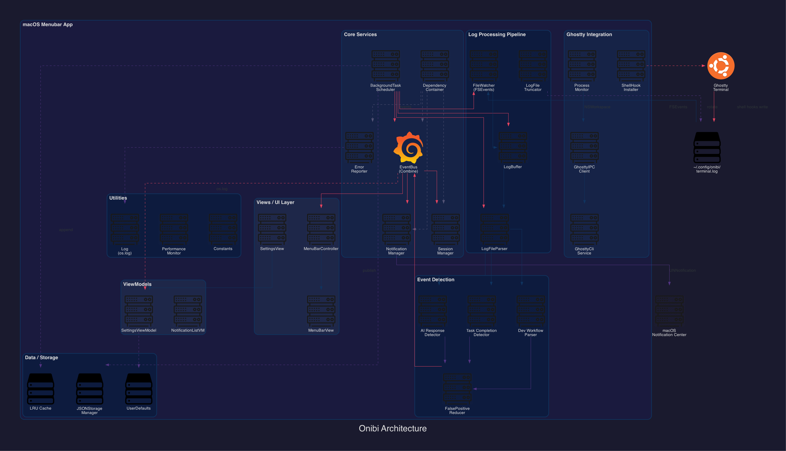

[](https://github.com/gongahkia/onibi/releases/tag/1.0)


# `Onibi`

MacOS menubar app to monitor your [Ghostty](https://ghostty.org/) sessions.

## Stack

* *Scripting*: [Swift](https://www.swift.org/), [SwiftUI](https://developer.apple.com/xcode/swiftui/), [AppKit](https://developer.apple.com/documentation/appkit), [Combine](https://developer.apple.com/documentation/combine), [macOS Notification Center](https://developer.apple.com/documentation/usernotifications), [FSEvents](https://developer.apple.com/documentation/coreservices/file_system_events)
* *Logging*: [os.log](https://developer.apple.com/documentation/os/logging)
* *Build*: [SPM](https://www.swift.org/documentation/package-manager/), [Xcode 15](https://developer.apple.com/xcode/)
* *CI/CD*: [GitHub Actions](https://github.com/features/actions), [SwiftLint](https://github.com/realm/SwiftLint)

## Screenshots

...

## Usage

1. Clone the repo and build from source.

```console
$ git clone https://github.com/gongahkia/onibi && cd onibi
$ swift build
$ swift test
```

2. Or open in Xcode.

```console
$ open Onibi.xcodeproj
```

3. Install shell hooks for your terminal. Add the following to your `~/.zshrc`.

```zsh
# onibi integration
_onibi_preexec() {
    echo "$(date -Iseconds)|CMD_START|$$|$1" >> ~/.config/onibi/terminal.log
}
_onibi_precmd() {
    local exit_code=$?
    echo "$(date -Iseconds)|CMD_END|$$|$exit_code" >> ~/.config/onibi/terminal.log
}
autoload -Uz add-zsh-hook
add-zsh-hook preexec _onibi_preexec
add-zsh-hook precmd _onibi_precmd
```

### Features

* **Command tracking**: Detects command start/end with exit codes
* **AI response detection**: Pattern-matches Claude, GPT and other AI assistant output
* **Task completion alerts**: Notifies on build, test and workflow completions 
* **Session management**: Tracks multiple Ghostty terminal sessions 
* **False positive reduction**: Confidence scoring and deduplication 
* **Native notifications**: macOS Notification Center with actionable buttons 
* **Log rotation**: Automatic truncation and rotation of log files 
* **Ghostty IPC**: Detects running Ghostty instances, reads config 
* **Theme sync**: Syncs popover theme colors from Ghostty config 

## Architecture

<div align="center">
    
</div>

## Reference

The name `Onibi` is in reference to the Japanese word [鬼火](https://en.wikipedia.org/wiki/Onibi), meaning *demon fire* or *ghost light* — a fitting companion for [Ghostty](https://ghostty.org/).