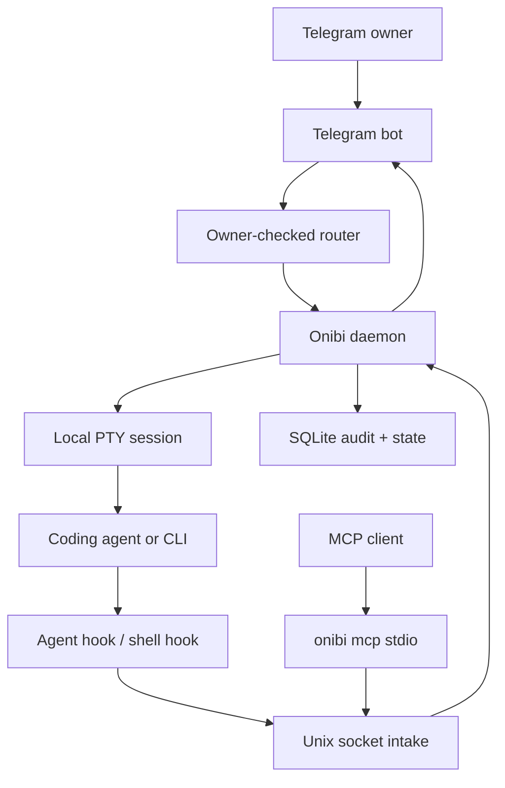

# Onibi

<p align="center">
  
</p>

<p align="center">
  <a href="https://github.com/gongahkia/onibi/actions/workflows/ci.yml"></a>
  
  
  
  
</p>

Telegram-controlled coding-agent host for local terminals.

Onibi runs as a local user daemon, hosts coding agents under PTYs, and routes approvals, turn-complete signals, screenshots, prompt queues, and session controls through a Telegram bot. It uses outbound HTTPS to Telegram only: no tunnels, no inbound ports, no hosted Onibi account.

Status: v2 development. Core daemon, setup, approvals, prompt queue, Telegram controls, service install, doctor, MCP, encrypted Mini App controls, and adapters are implemented. Live provider e2e and signed public release validation still gate a stable tag.

## Table of Contents

- [Quick Start](#quick-start)
- [What Onibi Does](#what-onibi-does)
- [Command Surface](#command-surface)
- [Examples](#examples)
- [How It Works](#how-it-works)
- [Runtime Modes](#runtime-modes)
- [Documentation](#documentation)
- [Development & Verification](#development--verification)
- [Packaging & Deployment](#packaging--deployment)
- [Screenshots](#screenshots)
- [Security](#security)
- [License](#license)

## Quick Start

Install from source:

```bash
git clone https://github.com/gongahkia/onibi
cd onibi
make install
onibi setup --complete
```

Check local health:

```bash
onibi doctor
onibi adapters
onibi config list
```

Start an agent:

```bash
onibi run claude
```

Or host any local TUI/CLI:

```bash
onibi shell
onibi wrap lazygit
```

Release install path after the Homebrew tap is published:

```bash
brew install --cask gongahkia/onibi/onibi
onibi setup --complete
```

`setup --complete` pairs your Telegram bot, stores the token in Keychain when available, offers service install, offers detected agent hooks, and ends with `onibi doctor`.

## What Onibi Does

- Hosts coding agents and arbitrary CLI/TUI commands under local PTYs.
- Sends owner-only Telegram approvals for agent tool calls.
- Sends turn-complete notifications, text tails, and PNG previews from the PTY buffer.
- Queues prompts when a session is busy, then dispatches them after the next turn-complete signal.
- Routes replies and `/target` selections to the right live session.
- Installs hooks for supported coding agents and shell command-done notifications.
- Provides `/secure` encrypted Mini App controls so prompt text and decisions can travel as ciphertext through Telegram.
- Exposes a local stdio MCP server for MCP-capable agents.
- Audits approvals, prompt injection, session input, and risk/anomaly events in the local SQLite state DB.

Onibi is not a hosted coding platform, remote desktop system, cloud IDE, or multi-user access gateway. It assumes the local OS user account is trusted.

## Command Surface

CLI:

- `onibi setup --complete`
- `onibi doctor`
- `onibi adapters`
- `onibi run <agent>`
- `onibi shell [zsh|bash|fish|sh]`
- `onibi wrap <command>`
- `onibi config list`
- `onibi log`
- `onibi tail-log`
- `onibi mcp`
- `onibi uninstall`

Telegram:

- `/new <agent>`
- `/sessions`
- `/status`
- `/secure`
- `/prompt <text>`
- `/queue`
- `/peek`
- `/target <id|name>`
- `/interrupt`
- `/kill`
- `/snooze`
- `/log`
- `/help`

Supported adapters: Claude Code, Codex, OpenCode, Goose, Gemini, GitHub Copilot CLI, Pi, Amp, plus opt-in zsh/bash/fish command-done hooks.

MCP tools exposed by `onibi mcp`:

- `onibi_notify`
- `onibi_approval_request`
- `onibi_session_list`
- `onibi_session_input`
- `onibi_session_peek`

## Examples

Run a Claude Code session:

```bash
onibi run claude
```

Run Codex with arguments:

```bash
onibi run codex -- --model gpt-5-codex
```

Wrap a local tool:

```bash
onibi shell
onibi config set shell.default zsh
onibi shell --no-login
onibi wrap vim
onibi wrap lazygit
```

Enable encrypted Telegram controls:

```bash
onibi setup --enable-encrypted-mode
onibi config set telegram.encrypted_mode on
onibi config validate
```

Use MCP from an MCP-capable client:

```bash
onibi mcp
```

Uninstall service and hooks while keeping state:

```bash
onibi uninstall
```

Remove Onibi-managed state and secrets:

```bash
onibi uninstall --state --yes
```

## How It Works

Onibi has six main runtime pieces:

1. The CLI in [`cmd/onibi/`](./cmd/onibi/) and [`internal/cli/`](./internal/cli/) owns setup, config, doctor, service, hook, log, MCP, run, wrap, and uninstall commands.
2. The daemon in [`internal/daemon/`](./internal/daemon/) owns sessions, approvals, prompt queueing, Telegram routing, PTY output, anomaly warnings, and MCP/intake events.
3. PTY hosting in [`internal/pty/`](./internal/pty/) starts local agent processes and streams output into a bounded ring buffer.
4. Telegram integration in [`internal/telegram/`](./internal/telegram/) handles owner filtering, commands, callbacks, rate limiting, long polling, and race warnings.
5. Adapters in [`internal/adapters/`](./internal/adapters/) install agent-specific hooks for Claude Code, Codex, Goose, Gemini, OpenCode, Copilot, Pi, Amp, and shell hooks.
6. Local state in [`internal/store/`](./internal/store/) and secrets in [`internal/secrets/`](./internal/secrets/) keep SQLite records, audit logs, owner pairing, prompt state, and bot credentials local.

Core flow:


```mermaid
flowchart TD
    Owner[Telegram owner] --> Bot[Telegram bot]
    Bot --> Router[Owner-checked router]
    Router --> Daemon[Onibi daemon]
    Daemon --> PTY[Local PTY session]
    PTY --> Agent[Coding agent or CLI]
    Agent --> Hook[Agent hook / shell hook]
    Hook --> Intake[Unix socket intake]
    Intake --> Daemon
    Daemon --> Store[SQLite audit + state]
    Daemon --> Bot
    MCP[MCP client] --> MCPServer[onibi mcp stdio]
    MCPServer --> Intake
```

## Runtime Modes

### Local Daemon

The normal mode is a user-level daemon with a local Unix socket and Telegram outbound traffic:

```bash
onibi setup --complete
onibi install-service
onibi doctor
```

macOS uses LaunchAgent. Linux uses user-level systemd.

### Interactive Run

Use `onibi run <agent>` for foreground sessions while developing or testing hooks:

```bash
onibi run claude
onibi run codex
onibi run goose
```

### Encrypted Telegram

Encrypted mode uses AES-GCM envelopes and a Telegram Mini App seed stored in Telegram SecureStorage:

```bash
onibi setup --enable-encrypted-mode
onibi config set telegram.encrypted_mode on
```

`telegram.encrypted_mode=on` encrypts approvals, session previews/output, prompt acknowledgements, logs/status/session lists, and Mini App actions. Use `/secure` for encrypted prompt entry so Telegram stores ciphertext.

### MCP

Run stdio transport:

```bash
onibi mcp
```

The daemon must already be running for `session_input`, `session_peek`, `notify`, and `approval_request`. `session_list` can read the local DB without a live daemon.

### Release Build

Local release smoke requires GoReleaser and Syft:

```bash
brew install goreleaser syft
goreleaser release --snapshot --clean --skip=publish --skip=sign
scripts/release-smoke.sh dist
```

Public release tags require Apple signing, notarization, Homebrew tap, GPG, and clean install validation.

## Documentation

- [`docs/security.md`](./docs/security.md): threat model, defenses, non-defenses, setup checklist, and encrypted mode notes.
- [`docs/troubleshooting.md`](./docs/troubleshooting.md): lost token, owner rotation, stale webhook, no updates, sleep/wake, service, and hook drift.
- [`docs/release.md`](./docs/release.md): release, signing, notarization, Homebrew, and clean-Mac validation checklist.
- [`docs/demo-checklist.md`](./docs/demo-checklist.md): demo flow.
- [`docs/tgterm-patterns.md`](./docs/tgterm-patterns.md): Telegram-terminal design notes and attribution.
- [`adapters/`](./adapters/): adapter-facing docs.
- [`hooks/`](./hooks/): shell hook docs.

## Development & Verification

Run the CI-equivalent checks:

```bash
go vet ./...
go test -race -count=1 ./...
go install honnef.co/go/tools/cmd/staticcheck@latest
staticcheck ./...
go install golang.org/x/vuln/cmd/govulncheck@latest
govulncheck ./...
```

Build local binaries:

```bash
make build
```

Run full local checks:

```bash
go test ./...
make test
go vet ./...
go run honnef.co/go/tools/cmd/staticcheck@latest ./...
go run golang.org/x/vuln/cmd/govulncheck@latest ./...
```

CI also runs GoReleaser snapshot smoke and reproducible-build checks:

```bash
goreleaser release --snapshot --clean --skip=publish --skip=sign
scripts/release-smoke.sh dist
scripts/reproducible-build.sh
```

## Packaging & Deployment

Build:

```bash
make build
```

Install to `~/.local/bin`:

```bash
make install
```

Install or remove service:

```bash
onibi install-service
onibi uninstall
```

Install or repair hooks:

```bash
onibi adapters
onibi doctor --fix
onibi install-hooks --interactive
```

Release artifacts are defined in [`.goreleaser.yaml`](./.goreleaser.yaml). Signed public releases remain gated on the manual release checklist.

## Screenshots

Launch flow:

<p align="center">
  
</p>

Reference screens and architecture assets live under [`asset/reference/`](./asset/reference/).

## Security

Bot token storage prefers macOS Keychain or Linux Secret Service; `.env` is a 0600 fallback. Every inbound Telegram update is checked against the paired owner chat id before handlers run. Approvals expire. Pairing uses a single-use deeplink token. High-risk approvals require a second confirm action.

Onibi does not defend against full compromise of the local user account or owner Telegram account. Enable Telegram 2-step verification. Full model: [`docs/security.md`](./docs/security.md).

## License

Apache-2.0. See [`LICENSE`](./LICENSE).
