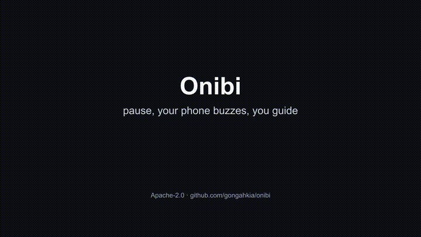
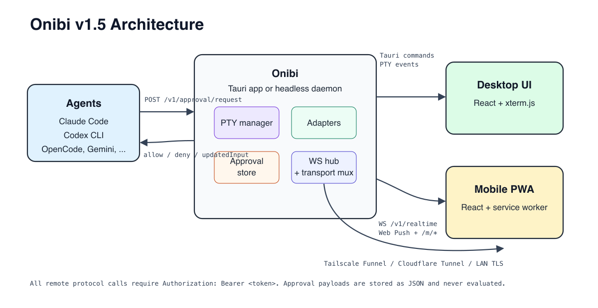

# Onibi

Onibi - local-first approval gate for multi-vendor coding agents.

[](https://github.com/gongahkia/onibi/actions/workflows/ci.yml)
[](LICENSE)

Onibi runs Claude Code, Codex, OpenCode, Goose, Qoder, Copilot CLI, and other local agents in a desktop or headless daemon. When an agent pauses before a tool call, Onibi blocks the hook, sends the approval to your desktop and phone, and lets you allow, deny, or edit the payload before it runs.



## Install

macOS:

```sh
brew tap gongahkia/onibi
brew install onibi
```

Linux / Raspberry Pi:

```sh
curl -fsSL https://onibi.sh/install.sh | bash
```

Source checkout:

```sh
git clone https://github.com/gongahkia/onibi
cd onibi
pnpm install
cd app/src-tauri
cargo build
```

## Quick Start

```sh
onibi setup
onibi doctor
onibi adapter install claude-code
onibi --headless --auto-transports
```

Then scan the pairing QR with your phone, install the PWA, and run:

```sh
claude code "remove the old generated test fixtures"
```

When Claude pauses at a tool call, Onibi shows the approval on desktop and phone. Editing `rm -rf tests/legacy` into `mv tests/legacy tests/legacy.bak` returns an `updatedInput` decision to the agent. The PWA can also send literal text or allowlisted presets into a selected Onibi pane over the same authenticated local transport.

## Architecture



Onibi is a single Rust/Tauri codebase with a headless mode. The same approval server backs the desktop UI, the mobile PWA, and the CLI.

Core protocol endpoints:

- `POST /v1/approval/request` - adapter long-polls until a decision exists.
- `POST /v1/approval/:id/decide` - desktop or phone submits allow/deny/edit.
- `POST /v1/panes/:id/send-text` - authenticated PWA sends literal text to a pane.
- `POST /v1/panes/:id/send-keys` - authenticated PWA runs a server-owned preset key sequence.
- `WS /v1/realtime` - approvals, run events, terminal output, and heartbeat.
- `GET /v1/qr` - pairing payload with token, machine ID, and transports.

## Agent Support

Approval-blocking adapters:

- Claude Code - full approve, deny, and edit-before-approve through `updatedInput`; optional ACP prompt/resume path.
- Codex CLI - Bash approval interception; `apply_patch` and MCP tools are not blocked.
- OpenCode - provider-event bridge, blocking pre-tool approval, and edited input forwarding.
- Qoder CLI - lifecycle events, blocking pre-tool approval, edited input forwarding, and resume metadata.
- GitHub Copilot CLI - lifecycle events, blocking pre-tool approval, edited argument forwarding.
- Goose - lifecycle events, blocking pre-tool approval, edited input forwarding, and resume metadata.

Mirror, protocol, resume-only, or pending-native adapters:

- Hermes - ACP permission approval plus GUI resume/reattach from provider session metadata.
- Gemini - resume metadata when provider session IDs are available.
- Aider - terminal mirror plus history-based restore.
- Cursor, Pi, and OMP - terminal mirror, heuristic detection, and observe-only native hooks.

Platforms:

| Platform | Desktop app | Headless daemon | Notes |
| --- | ---: | ---: | --- |
| macOS arm64/x86_64 | Yes | Yes | Homebrew install path. |
| Linux x86_64 | Yes | Yes | AppImage/deb plus curl-pipe daemon. |
| Raspberry Pi 5 arm64 | No | Yes | Headless-first self-hosted path. |
| Windows | No | No | Not planned for v1.5. |

Transports:

| Transport | Public LTE access | Account | Notes |
| --- | ---: | ---: | --- |
| Tailscale Funnel | Yes | Tailscale | Best persistent personal setup. |
| Cloudflare Quick Tunnel | Yes | No | Best demo path; URL is ephemeral. |
| LAN HTTPS | No | No | Requires trusting Onibi's self-signed cert. |

## How Onibi Is Different

Onibi is the local-first approval gate for multi-vendor agents with edit-before-approve. The approval is a structured protocol object, not just a notification: the tool call blocks, your phone gets context, and the final decision can include an edited payload.

The desktop app, mobile PWA, CLI, and headless daemon all talk to the same local server. There are no accounts, no telemetry, and no hosted relay in v1.5.

## Docs

- [Security model](docs/security.md)
- [Adapter capabilities](docs/adapters.md)
- [Approval policies](docs/policies.md)
- [Transports](docs/transports.md)
- [Troubleshooting](docs/troubleshooting.md)

## Roadmap

Near-term work is focused on landing-page/docs cleanup, WSL2 install notes, and post-launch desktop parity for the PWA remote-input composer.

## License

Apache-2.0. See [LICENSE](LICENSE).
