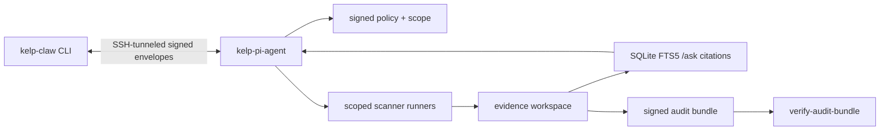

# KelpClaw

KelpClaw is local AppSec for Raspberry Pi 5. It wraps AI-assisted security triage with scoped execution, policy gates, passive scanner evidence, SARIF output, replayable logs, and signed audit bundles.

The primary product path is Kelp Pi: a hardened Raspberry Pi 5 field appliance for authorized onsite or airgapped assessment. The laptop harness remains supported, but users trying Kelp should expect Raspberry Pi 5 hardware as the reference environment.

The goal is not to be an autonomous exploit bot. KelpClaw is built for operators who want AI-assisted vulnerability triage that can be reviewed, reproduced, and handed to security teams without trusting an opaque chat transcript.

## What It Does

- Builds a declared Dockerfile target and records build metadata.
- Imports scanner outputs from SARIF, Nuclei, ZAP, Nmap, Burp, and Nessus.
- Runs a scoped AppSec triage assistant through `--agent-command`.
- Forbids exploit execution by default under `appsec-agent-baseline`.
- Emits normalized findings, SARIF, logs, policy decisions, and signed evidence.
- Produces a static audit bundle that can be opened without running KelpClaw.

## Quickstart

Pi readiness from a laptop:

```console
$ corepack enable
$ pnpm install --frozen-lockfile
$ pnpm --filter @kelpclaw/cli build
$ kelp-claw pi lab init \
  --host <pi-host> \
  --ssh-user <imager-ssh-user> \
  --control-url https://<control-plane-host>:443/health \
  --target-ip <fixture-ip> \
  --target-url http://fixture.local \
  --nuclei-approval-token <approval-token> \
  --client-a <ap-client-a-ip> \
  --client-b <ap-client-b-ip>
$ kelp-claw pi doctor --strict
$ kelp-claw pi validate
```

Laptop-only harness:

```console
$ corepack enable
$ pnpm install --frozen-lockfile
$ pnpm --filter @kelpclaw/cli build
$ pnpm --filter @kelpclaw/cli exec kelp-claw doctor
```

Create an agent command that reads `KELPCLAW_APPSEC_INPUT` and writes JSON to `KELPCLAW_APPSEC_OUTPUT`, then run:

```console
$ kelp-claw appsec audit \
  --context . \
  --dockerfile Dockerfile \
  --agent-command ./appsec-agent.sh \
  --sarif findings.sarif \
  --out .kelpclaw/appsec/local
```

Verify the signed bundle:

```console
$ kelp-claw verify-audit-bundle .kelpclaw/appsec/local/audit-bundle
```

See [`docs/appsec-harness.md`](docs/appsec-harness.md) for the agent I/O contract and evidence layout.

## Kelp Pi

Kelp Pi is the reference Kelp product surface: a battery-powered Raspberry Pi 5 hardened AppSec field drop-box with scoped scanning, signed audit bundles, offline cited retrieval, no cloud dependency, and no exploit execution by default. Minimum hardware is Raspberry Pi 5 with 4GB RAM and 56GB+ usable storage for Nuclei/Nmap, local retrieval, bundles, and small RAM-gated Ollama models. Raspberry Pi 5 8GB with NVMe is the recommended profile.

Headless Pi install:

```console
$ curl -fsSL https://raw.githubusercontent.com/gongahkia/kelp/main/scripts/install-kelp-pi.sh | sudo sh
$ kelp-pi preflight
$ kelp-pi
$ kelp-pi models install qwen2.5:0.5b
$ kelp-pi doctor
```

Laptop control path:

```console
$ kelp-claw pi doctor
$ kelp-claw pi doctor --strict --check-release-online
$ kelp-claw pi bootstrap --host <pi-host> --ssh-user <imager-ssh-user> --dry-run
$ kelp-claw pi connect
$ kelp-claw pi validate
$ kelp-claw pi recover network --force --dry-run
```

The curl installer defaults to the latest GitHub release binary and falls back to source only when explicitly requested with `--build-from-source`. `kelp-claw pi bootstrap` runs the same installer over SSH after `--dry-run`; pass `--yes` to execute. Network/AP hardening is explicit so the install does not cut an active SSH session, and `kelp-pi` snapshots network files before render/apply so `kelp-claw pi recover network --force` can roll back. Field acceptance emits a Pi-signed `acceptance-manifest.json`, signature, and public key next to the logs. Start with [`docs/pi-quickstart.md`](docs/pi-quickstart.md); deeper design lives in [`docs/pi.md`](docs/pi.md), [`docs/pi-todo.md`](docs/pi-todo.md), and [`docs/architecture.mmd`](docs/architecture.mmd).

Kelp Pi non-goals: operator anonymity, covert use, evasion, cellular or phone replacement features, always-listening voice, internet-scale scanning, scanning outside declared scope, target persistence, lateral movement, credential exfiltration, general self-hosting, and uncited generated answers.


```mermaid
flowchart LR
  cli["kelp-claw CLI"] <-->|"SSH-tunneled signed envelopes"| agent["kelp-pi-agent"]
  agent --> policy["signed policy + scope"]
  agent --> scan["scoped scanner runners"]
  scan --> evidence["evidence workspace"]
  evidence --> index["SQLite FTS5 /ask citations"]
  evidence --> bundle["signed audit bundle"]
  index --> agent
  bundle --> verify["verify-audit-bundle"]
```

## Existing Primitives

- `packages/evidence`: evidence workspaces, passive scanner imports, QA, signing, and verification.
- `packages/policy`: policy evaluator and built-in policy packs including `appsec-agent-baseline`.
- `packages/agent-hooks`: agent tool-event normalization.
- `packages/nanoclaw`: deterministic execution, Docker runner, replay data, hashes, and policy decisions.
- `packages/codegen`: artifact store and replay helpers.
- `packages/cli`: AppSec audit, skill audit, evidence, policy, inventory, SARIF, and audit bundle commands.
- `packages/workflow-spec`: shared workflow IR types, schemas, fixtures, and validators.
- `packages/testing`: deterministic harnesses and regression fixtures.

## CLI Surface

```console
$ kelp-claw help
$ kelp-claw appsec audit --context . --dockerfile Dockerfile --agent-command ./appsec-agent.sh
$ kelp-claw evidence import-sarif findings.sarif --workspace .kelpclaw/evidence
$ kelp-claw inventory scan --root . --policy appsec-agent-baseline
$ kelp-claw export-audit-bundle <runId> --include-sarif
```

## Safety Boundary

KelpClaw v1 does not execute exploits. Scanner execution can be done outside KelpClaw and imported as evidence. The AppSec assistant can correlate evidence and recommend validation, but active exploit validation is intentionally outside the default harness.

## Developer Setup

```console
$ pnpm -r build
$ pnpm -r test
```

## License

MIT. See [`LICENSE`](LICENSE).
