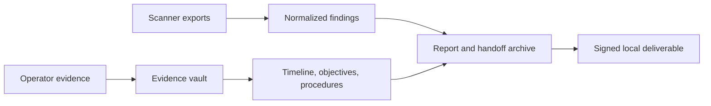

<p align="center">
  <a href="https://github.com/gongahkia/piranesi">
    
  </a>
</p>

<h1 align="center">Piranesi</h1>

<p align="center">
  <strong>Local-first red-team engagement workspace.</strong>
</p>

<p align="center">
  <a href="https://github.com/gongahkia/piranesi/actions/workflows/ci.yml"></a>
  <a href="https://github.com/gongahkia/piranesi/blob/main/LICENSE"></a>
  <a href="https://github.com/gongahkia/piranesi"></a>
</p>

---

Piranesi turns authorized red-team engagement artifacts into local, reviewable
deliverables: preserved evidence, normalized findings, report artifacts, retest diffs,
and signed chain-of-custody manifests. It is not a scanner, C2 platform, SaaS portal,
fleet manager, or automated compliance engine. You bring operator artifacts and tool
output; Piranesi keeps the evidence local and produces artifacts a team can inspect,
sign, preview, and hand off.

`v0.2.0` is the pivot release. The documented Phase 1 workflow is intentionally
small, with scanner imports retained as one evidence source:

```text
piranesi evidence
piranesi agent
piranesi ingest
piranesi report
piranesi rescan
piranesi retest
piranesi sign
piranesi serve
```

Historical host-posture, source-code scanning, infrastructure, and workflow docs are
retained only as legacy context. They are not current product guidance unless a
future roadmap issue explicitly reintroduces them.

## Why Piranesi

Consultants already run tools such as nmap, nuclei, Burp, ZAP, Nessus, ffuf, and
sqlmap. The slow work comes later: preserving evidence, deduplicating findings,
writing reports, tracking retests, proving provenance, and handing off artifacts
without leaking client data.

Piranesi focuses on that artifact layer:

- **Import-only by default:** normal workflows do not run active scans or payloads;
  `rescan` is an explicit replay path for already ingested scanner evidence.
- **Agent-pluggable:** external pentest or triage agents can be invoked through
  `piranesi agent run`, receive scoped context, and return validated PFF findings
  plus local evidence.
- **Operator-evidence aware:** screenshots, transcripts, logs, and other artifacts can
  be preserved in the local evidence vault from the CLI or browser UI.
- **Evidence-bound:** findings cite raw tool exports, source digests, and locators.
- **Local-first:** workspaces, reports, signatures, and previews stay on disk.
- **Deterministic:** normalized IDs and contract snapshots make reports reproducible.
- **Reviewable:** Markdown, JSON, PDF, handoff archives, retest output, and signatures
  are inspectable.

## Red-Team Workspace Flow


```mermaid
flowchart LR
  A["Operator evidence"] --> B["Evidence vault"]
  C["Scanner exports"] --> D["Normalized findings"]
  B --> E["Timeline, objectives, procedures"]
  D --> F["Report and handoff archive"]
  E --> F
  F --> G["Signed local deliverable"]
```

Scanner imports are one evidence source. The broader workspace also tracks operator
notes, screenshots, transcripts, C2-style logs, objectives, procedures, detection
handoff notes, report artifacts, and custody manifests.

## Quick Start

From a source checkout:

```bash
uv sync
uv run piranesi ingest init --workspace ./workspace \
  --client "Example Client" \
  --project "Loopback Lab" \
  --scope 127.0.0.1
printf "Initial operator note\n" > operator-note.txt
uv run piranesi evidence add \
  --file operator-note.txt \
  --kind note \
  --workspace ./workspace \
  --title "Initial operator note"
uv run piranesi ingest nmap \
  --input tests/fixtures/pentest/nmap/localhost-http.xml \
  --workspace ./workspace
uv run piranesi ingest nuclei \
  --input tests/fixtures/pentest/nuclei/localhost-http.jsonl \
  --workspace ./workspace
uv run piranesi ingest burp \
  --input tests/fixtures/pentest/burp/lab-issues.xml \
  --workspace ./workspace
uv run piranesi ingest zap \
  --input tests/fixtures/pentest/zap/localhost-alerts.json \
  --workspace ./workspace
uv run piranesi ingest nessus \
  --input tests/fixtures/pentest/nessus/localhost-web.nessus \
  --workspace ./workspace
uv run piranesi ingest sarif \
  --input tests/fixtures/pentest/sarif/local-sast.sarif.json \
  --workspace ./workspace
uv run piranesi ingest ffuf \
  --input tests/fixtures/pentest/ffuf/localhost-discovery.json \
  --workspace ./workspace
uv run piranesi ingest sqlmap \
  --input tests/fixtures/pentest/sqlmap/localhost-sqli.json \
  --workspace ./workspace
uv run piranesi ingest metasploit \
  --input tests/fixtures/pentest/metasploit/local-evidence.json \
  --workspace ./workspace
uv run piranesi ingest c2 \
  --input tests/fixtures/redteam/c2/mock-c2-events.jsonl \
  --workspace ./workspace \
  --title "Mock C2 event log"
uv run piranesi report --workspace ./workspace --format md
uv run piranesi report \
  --workspace ./workspace \
  --type red-team \
  --format archive \
  --include-raw-evidence
uv run piranesi sign --workspace ./workspace
uv run piranesi serve --workspace ./workspace
```

Connect an existing external pentest or triage agent once, then invoke it through
Piranesi:

```bash
uv run piranesi agent presets
uv run piranesi agent add --workspace ./workspace --preset codex
uv run piranesi agent add \
  --workspace ./workspace \
  --name team-agent \
  --command 'team-agent triage --context {context} --manifest {manifest}' \
  --check-command 'team-agent --version' \
  --login-command 'team-agent login'
uv run piranesi agent add \
  --workspace ./workspace \
  --preset cloud-http \
  --name cloud-triage \
  --remote-url https://agent.example.test/run \
  --remote-auth-env TEAM_AGENT_TOKEN
uv run piranesi agent check --workspace ./workspace --agent team-agent
uv run piranesi agent login --workspace ./workspace --agent team-agent
uv run piranesi agent run \
  --workspace ./workspace \
  --agent team-agent \
  --approved-by operator@example.test \
  --approval-reference ROE-1234 \
  --live
```

Built-in presets cover OpenClaw, Claude Code, Codex CLI, and generic HTTPS
cloud agents. `agent login` runs OAuth-capable CLI login commands or verifies an
API-key environment variable without storing the secret. If an agent can only
print prose, run with `--prose-fallback` to preserve stdout/stderr as evidence
without inventing structured findings.

If the agent ran outside the wrapper, import its local manifest directly with
`uv run piranesi agent validate-run --manifest agent-run.json` and
`uv run piranesi agent import-run --workspace ./workspace --manifest agent-run.json`.

Generate a PDF with the deterministic fallback renderer:

```bash
uv run piranesi report \
  --workspace ./workspace \
  --format pdf \
  --pdf-backend reportlab
```

Compare two workspace snapshots after a retest:

```bash
uv run piranesi retest \
  --baseline ./workspace-before \
  --current ./workspace-after \
  --output retest.json
```

Verify a signed workspace manifest:

```bash
uv run piranesi sign --workspace ./workspace --verify
```

Optional rescan/runtime support is intentionally separate from the default install:

```bash
uv sync --extra rescan
```

Replay previously ingested nmap or nuclei evidence into a new workspace:

```bash
uv run piranesi rescan \
  --from-baseline ./workspace-before \
  --output-workspace ./workspace-after \
  --dry-run
```

Execution requires digest-pinned images and an explicit network-policy
acknowledgement until scoped egress enforcement lands:

```bash
uv run piranesi rescan \
  --from-baseline ./workspace-before \
  --output-workspace ./workspace-after \
  --image nmap=ghcr.io/example/nmap:v1@sha256:<digest> \
  --allow-unenforced-network
```

## Current Capabilities

Implemented Phase 1 pieces:

- Pentest workspace contract with raw evidence, normalized findings, reports,
  signatures, and append-only audit log.
- Red-team evidence inventory for operator artifacts such as screenshots, notes,
  transcripts, payload metadata, detection artifacts, and C2 logs.
- Real fixture policy and provenance validation for parser fixtures.
- nmap XML ingestion.
- nuclei JSONL ingestion.
- Burp Suite Pro Issues XML ingestion.
- OWASP ZAP JSON alert ingestion.
- Nessus `.nessus` XML ingestion.
- SARIF 2.1.0 findings ingestion.
- ffuf JSON discovery output ingestion.
- sqlmap JSON/text artifact ingestion.
- Metasploit JSON evidence ingestion for vulnerability, loot, and session records.
- Neutral C2 JSONL import into evidence and timeline.
- Pentest report rendering to JSON, Markdown, and PDF.
- Red-team handoff rendering to JSON, Markdown, PDF, and archive ZIP.
- Chain-of-custody manifest creation and verification.
- Opt-in `rescan --from-baseline` replay for supported nmap and nuclei baseline
  evidence, with optional runtime checks, digest-pinned images, and raw outputs
  shaped for existing ingest commands.
- Retest lifecycle diff with `new`, `open`, `closed`, `changed`, `regressed`, and
  `ambiguous` statuses.
- Local loopback web app via `piranesi serve`, including empty-workspace setup and
  typed note capture plus browser file upload for evidence artifacts.
- External pentest agent bridge via `piranesi agent`, allowing operator-managed
  testing agents to consume scoped context and return validated local PFF/evidence
  run manifests.

See [docs/capabilities.md](docs/capabilities.md) for the detailed Phase 1 matrix and
[docs/known-limitations.json](docs/known-limitations.json) for tracked limitations.

## Workspace Layout

| Workspace                 | Ownership                                                                                |
| ------------------------- | ---------------------------------------------------------------------------------------- |
| `apps/openclaw`           | React + React Flow workflow planning UI                                                  |
| `apps/api`                | HTTP API for planning, workflow persistence, validation, approval, and execution control |
| `packages/workflow-spec`  | Shared workflow IR types, Zod schemas, JSON Schema, fixtures, and validation errors      |
| `packages/skill-registry` | Built-in deterministic skills, metadata, metaprompts, and lookup rules                   |
| `packages/nanoclaw`       | DAG compiler, production runner, Docker command runner, and deterministic test runner    |
| `packages/codegen`        | Generated artifact contracts, checksums, and replay policy helpers                       |
| `packages/adapters`       | Live provider adapters, generic connectors, and deterministic test mocks                 |
| `packages/web-intel`      | Governed Exa/TinyFish web search, fetch, answer, browser, and evidence normalization     |
| `packages/evidence`       | Piranesi-derived local evidence vault, normalized findings, custody, QA, and retest diff |
| `packages/testing`        | Shared fixtures, mock providers, and deterministic execution harnesses                   |

## Development

Quality gates used for Phase 1 changes:

```bash
uv run python scripts/validate_pentest_fixtures.py
uv run ruff check src/ tests/
uv run ruff format --check src/ tests/
uv run mypy src/piranesi/
uv run pytest -q -m "not integration and not joern and not docker and not e2e and not slow"
```

When CLI help changes, update and review the contract snapshot:

```bash
uv run python scripts/update_contract_snapshots.py
uv run pytest -q tests/test_contract_snapshots.py
```

Quickstart, deployment notes for durable SQLite mode, Docker Compose, and production readiness live in
[`docs/quickstart.md`](docs/quickstart.md),
[`docs/deployment.md`](docs/deployment.md),
[`docs/agent-runtime-demo.md`](docs/agent-runtime-demo.md),
[`docs/skill-governance-demo.md`](docs/skill-governance-demo.md),
[`docs/security-review-demo.md`](docs/security-review-demo.md),
[`docs/agent-inventory.md`](docs/agent-inventory.md),
[`docs/piranesi-integration.md`](docs/piranesi-integration.md),
[`docs/web-intel.md`](docs/web-intel.md), and
[`docs/production-readiness.md`](docs/production-readiness.md).

## Workflow V1 Model

KelpClaw uses the canonical workflow JSON IR with `schemaVersion: "1.0.0"`. The top-level workflow fields are `id`, `schemaVersion`, `name`, `prompt`, `revision`, `nodes`, `edges`, `approval`, `createdAt`, and `updatedAt`.

Workflow nodes use `kind` instead of the earlier planner `type` shape. Supported node kinds are `trigger`, `skill`, `codegen`, `transform`, `approval`, and `delivery`. Each node declares a human description, JSON-Schema-compatible input and output ports, config, runtime settings, and determinism metadata.

Edges are port-aware: each edge connects `source.nodeId/source.port` to `target.nodeId/target.port`. Validation reports stable error codes for duplicate nodes, missing node references, invalid ports, DAG cycles, unapproved execution, unsupported schema versions, and missing codegen provenance or replay metadata.

Canonical serialization keeps object keys and collections stable for snapshots, review diffs, and DAG hashing. The migration harness currently passes through v1 workflows and rejects unsupported schema versions so future IR upgrades can be added without changing callers.

## Approval And Execution

Approving a workflow freezes the current revision into `workflow.approval`, including the approver, approval timestamp, frozen DAG hash, and compiled node order. NanoClaw compiles only approved workflow revisions and emits a v1 `execution_result` envelope for both mock and Docker-backed runners.

Editing an approved workflow creates a new draft revision. Execution remains blocked until that current revision is approved.

## NanoClaw Runtime Controls

API runs use the production runner by default. Adapter nodes invoke canonical live adapters (`adapter.gmail`, `adapter.sheets`, `adapter.email`, `adapter.whatsapp`, `adapter.telegram`, `adapter.github`, `adapter.slack`, `adapter.discord`, `adapter.notion`, `adapter.linear`, `adapter.jira`, `adapter.airtable`, `adapter.webhook`), deterministic built-in nodes run in-process, and custom/codegen nodes fall back to Docker. Set `NANOCLAW_RUNNER=mock` only for tests and offline demos. Optional controls are `NANOCLAW_DOCKER_BIN` for a non-default Docker binary and `NANOCLAW_HOST_WORKSPACE` for command-construction compatibility.

NanoClaw writes each run under a preserved workspace in the OS temp directory unless callers pass `workspaceRoot`. The workspace contains `workflow.json`, per-node `input.json` and `output.json`, `stdout.log`, `stderr.log`, an `artifacts/` directory, and `run-manifest.json` for replay.

Docker nodes receive only declared runtime environment variables plus NanoClaw paths:

- `NANOCLAW_WORKFLOW_SPEC`
- `NANOCLAW_NODE_INPUT`
- `NANOCLAW_NODE_OUTPUT`
- `NANOCLAW_ARTIFACTS_DIR`
- `NANOCLAW_NODE_ID`
- `NANOCLAW_ATTEMPT`

Containers mount the frozen workflow spec read-only and the node attempt workspace read-write. Network mode is `none` unless the node declares adapter or external API access. CPU, memory, timeout, retry count, backoff, logs, artifacts, attempts, skipped downstream nodes, and replay metadata are captured in the execution result.

## Skill Registry

The built-in skill registry records input and output schemas, required secrets, live adapter dependencies, runtime templates, metaprompts, validation rules, and example fixtures. Deterministic matching returns scored `SkillMatch` results with explainable reasons. Registry skills are preferred over codegen when the top match reaches the fixed reuse threshold.

## SKILL.md Audit Runner

KelpClaw can analyze and run agent skills in an audit-first mode:

```console
$ kelp-claw compat ./SKILL.md --policy baseline
$ kelp-claw policy explain ./SKILL.md --policy baseline
$ kelp-claw governance report ./SKILL.md --region sg --framework agentic-ai --policy sg-agentic-ai-baseline
$ kelp-claw governance controls ./SKILL.md --region sg --framework agentic-ai --out controls.md
$ kelp-claw export-sarif ./SKILL.md --policy baseline --out findings.sarif
$ kelp-claw run-skill ./SKILL.md --input input.json
$ kelp-claw run-skill ./SKILL.md --input input.json --agent codex-cli --wrapper --enforce-policy
$ kelp-claw run-skill github:owner/repo/path/SKILL.md --input input.json
$ kelp-claw governance report <runId> --region sg --framework agentic-ai
$ kelp-claw export-audit-bundle <runId> --include-governance --include-controls --include-sarif --region sg --framework agentic-ai
$ kelp-claw verify-audit-bundle .kelpclaw/audit-bundles/<runId> --strict
$ kelp-claw replay-diff --skill ./SKILL.md --agents claude-code,codex-cli,goose
$ kelp-claw replay-diff --recorded --skill ./SKILL.md --input input.json --agents codex-cli,custom-agent
$ kelp-claw web search "Singapore agentic AI governance" --provider exa --policy sg-web-research --out .kelpclaw/web-evidence/sg-ai
$ kelp-claw web fetch https://example.com/source --provider tinyfish --out .kelpclaw/web-evidence/source
$ kelp-claw export-audit-bundle <runId> --include-web-evidence .kelpclaw/web-evidence/sg-ai --include-governance
$ kelp-claw evidence init --workspace .kelpclaw/evidence --client "Example Client" --project "Agent Review"
$ kelp-claw evidence add --workspace .kelpclaw/evidence --file operator-note.txt --kind note --title "Operator note"
$ kelp-claw evidence import-sarif --workspace .kelpclaw/evidence findings.sarif
$ kelp-claw evidence sign --workspace .kelpclaw/evidence
$ kelp-claw evidence verify --workspace .kelpclaw/evidence
$ kelp-claw export-audit-bundle <runId> --include-evidence .kelpclaw/evidence --include-governance
$ kelp-claw inventory scan --root . --policy sg-agentic-ai-baseline --out .kelpclaw/inventory/agent-inventory.json
$ kelp-claw inventory graph --root . --format markdown --out .kelpclaw/inventory/permissions.md
$ kelp-claw inventory coverage --root . --format markdown --fail-on high --out .kelpclaw/inventory/coverage.md
```

`compat` reports detected tools, required secrets, network posture, sandbox profile, and policy findings. `run-skill` writes deterministic local artifacts under `.kelpclaw/runs/<runId>/`, including `skill.json`, `workflow.json`, `bom.json`, `audit.jsonl`, and `policy-decisions.json`. With `--agent codex-cli`, KelpClaw materializes a temporary workspace, invokes `codex exec`, captures stdout/stderr, installs a local hook command for compatible agents, records hook-derived `PreToolUse`/`PostToolUse` events when available, evaluates policy, and stores generated artifact metadata. Planned policy denials block before launch; hook-denied pre-tool events block the run under `--enforce-policy`. `export-audit-bundle` creates a static bundle with an offline `index.html`.

`policy explain` shows the exact planned tool steps and policy decisions for a skill. `governance report` emits SG/APAC-oriented evidence for autonomy tier, tool/data/network risk, human approval points, auditability, replay evidence, residual risks, and framework mappings. `governance controls` produces a reviewer-facing controls matrix, and `export-sarif` converts policy/governance/web findings into SARIF 2.1.0 for GitHub code scanning and security review. `--wrapper` adds stricter Codex CLI handling by normalizing Codex JSONL tool events into KelpClaw hook events and failing closed on unclassified enforced tool events. `export-audit-bundle` signs a manifest and attestation with a local Ed25519 key by default; use `kelp-claw audit-key init` to create the key explicitly and `verify-audit-bundle --strict` before forwarding the static bundle.

`kelp-claw web` adds governed Exa/TinyFish web intelligence. `search`, `fetch`, `answer`, and `research` evaluate a policy pack before the provider call, normalize sources into KelpClaw web evidence, hash source content, redact obvious secrets and emails, and optionally write `web-evidence.json`, `web-events.jsonl`, `web-bom.json`, and `web-evidence.html`. Set `EXA_API_KEY` and/or `TINYFISH_API_KEY` for live calls. Attach the evidence to `governance report` or `export-audit-bundle` with `--include-web-evidence <dir-or-json>`.

`kelp-claw evidence` ports the useful Piranesi concepts into KelpClaw: a local evidence vault, normalized findings, SARIF import, append-only audit log, chain-of-custody manifest, delivery QA, and retest diff. Attach it to governance reports or audit bundles with `--include-evidence <workspace>`.

`kelp-claw inventory` scans a repository for SKILL.md files, recorded runs, signed audit bundles, governed web evidence, evidence workspaces, KelpClaw GitHub Action workflows, and MCP web gateways. `inventory graph` renders a permission graph of skills, tools, secrets, policies, bundles, attestations, web evidence, and evidence workspaces; `inventory coverage` reports missing signed bundles, missing attestations, networked skills without web evidence, unsigned evidence workspaces, and CI coverage gaps.

Built-in policy packs are available without writing YAML on day one:

```console
$ kelp-claw policy use baseline
$ kelp-claw policy use finance-sg
$ kelp-claw policy use pii-strict
$ kelp-claw policy use no-destructive-shell
$ kelp-claw policy use github-pr-safe
$ kelp-claw policy use sg-agentic-ai-baseline
$ kelp-claw policy use sg-pdpa-strict
$ kelp-claw policy use sg-financial-ai
$ kelp-claw policy use asean-genai-baseline
$ kelp-claw policy use web-search-safe
$ kelp-claw policy use sg-web-research
$ kelp-claw policy use browser-automation-strict
```

Expose the same governed web gateway to MCP clients with:

```console
$ kelp-claw mcp web-gateway --policy sg-web-research
$ kelp-claw mcp web-gateway --policy browser-automation-strict --allow-browser-tools
```

Use the bundled GitHub Action in PR workflows:

```yaml
- uses: gongahkia/kelp-claw/.github/actions/audit-skill@main
  with:
    skill: ./SKILL.md
    policy: sg-agentic-ai-baseline
    governance: "true"
    region: sg
    framework: agentic-ai
    fail-on-unrunnable: "true"
    upload-sarif: "true"
```

Use repository inventory mode for periodic or PR-level agent estate checks:

```yaml
- uses: gongahkia/kelp-claw/.github/actions/audit-skill@main
  with:
    mode: inventory
    inventory-root: .
    policy: sg-agentic-ai-baseline
    fail-on-coverage: high
```

The compatibility corpus in `fixtures/skills-corpus` contains representative public-style skills and expected reports for regression tests.

## Auth, Secrets, And Integrations

The API server requires `KELPCLAW_ADMIN_TOKEN` outside test construction. OpenClaw sends it as a Bearer token from its integration panel or `VITE_OPENCLAW_ADMIN_TOKEN`.

Production secrets use encrypted local SQLite storage with `KELPCLAW_SECRET_MASTER_KEY`. Workflow specs store only `secret:<name>` refs; raw values are written through `/api/secrets` or the OpenClaw setup panel and are never returned by list APIs.

Google uses OAuth web flow endpoints under `/api/integrations/google/*`. SMTP email, WhatsApp Cloud API, Telegram Bot API, GitHub, Slack, Discord, Notion, Linear, Jira Cloud, Airtable, generic webhook delivery, and database adapters use encrypted provider secrets. The built-in database runtime supports SQLite directly and exposes a `DatabaseClient` contract for Postgres, MySQL, and other engines. Mock adapters and `.fake` ids remain test helpers only.

## Phase 5 Codegen

`POST /api/workflows/plan` now uses the registry-backed draft planner instead of the legacy fixture mock. The planner checks built-in and promoted skill metadata first. When no deterministic skill reaches the reuse threshold, it creates an explicit codegen node with planner rationale, generated source and dependency artifact references, sandbox policy, review state, and replay metadata.

Live code generation can use the Anthropic Agent SDK, OpenAI Responses API, or an OpenAI-compatible open-weight chat-completions endpoint. Set `KELPCLAW_PLANNER_PROVIDER=anthropic` with `ANTHROPIC_API_KEY`, `KELPCLAW_PLANNER_PROVIDER=openai` with `OPENAI_API_KEY`, or `KELPCLAW_PLANNER_PROVIDER=openweight` with `KELPCLAW_OPENWEIGHT_BASE_URL`. `KELPCLAW_CODEGEN_PROVIDER` can override the planner provider for generated-node build roles. Tests and local deterministic harnesses inject fake generators, so CI does not need live provider credentials.

Generated artifacts are written to a content-addressed local store. Set `KELPCLAW_ARTIFACT_STORE` to override the default `.kelpclaw/artifacts` path. Runtime-generated artifacts are ignored by git.

Codegen nodes must be reviewed before approval:

```console
$ curl -X POST /api/workflows/:id/codegen/:nodeId/review
$ curl -X POST /api/workflows/:id/codegen/:nodeId/promote
```

NanoClaw is the deterministic workflow runtime, not a model provider. It verifies stored artifact hashes before execution, materializes reviewed generated source into the isolated node workspace, and never regenerates code during approved runs. Promotion writes a reusable skill record to the artifact store and registers it so future matching can reuse the promoted skill instead of creating another codegen node.

## Validation Guarantees

- Workflow specs are diffable and validated with stable error codes.
- OpenClaw renders the shared v1 fixtures with schema version, revision, prompt, node kind, port-aware edges, and approval state.
- NanoClaw execution is covered through an approved-workflow mock runner and Docker command-construction tests.
- Integration adapters are production-capable; missing live secrets fail as structured run output.
- CI runs TypeScript format, lint, typecheck, tests, and builds.
