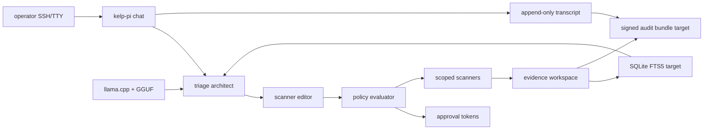

# KelpClaw

KelpClaw is a local-only AppSec triage chat agent for Raspberry Pi 5. The target runtime is one Pi-resident `kelp-pi` binary that uses local GGUF weights through `llama.cpp`, gates tool actions through policy, and emits signed reproducible evidence bundles.

## Status

- Active pivot: Zig `kelp-pi` implementation in `app/main.zig`.
- Legacy reference code: TypeScript packages and Rust `packages/pi-agent` stay in tree until Zig parity.
- Runtime target: no cloud APIs, no laptop control plane, no provider SDKs, no Ollama daemon.
- Current blockers: generated answer synthesis is not wired into `ask`, append-only transcript/hash-chain audit is not implemented, and real Pi acceptance still depends on a Linux/aarch64 linked package plus `.kelp-pi/acceptance.env`.

## Quickstart

```console
$ corepack enable
$ pnpm install --frozen-lockfile
$ pnpm zig:test
$ pnpm zig:build
$ ./zig-out/bin/kelp-pi doctor --data-dir .kelp-pi
```

Build and smoke-test the native `llama.cpp` path:

```console
$ pnpm llama:build
$ pnpm zig:build:llama
$ pnpm llama:smoke
$ pnpm pi:package
```

Run the local policy gate:

```console
$ ./zig-out/bin/kelp-pi policy check --tool Bash --command 'sqlmap -u http://target'
$ ./zig-out/bin/kelp-pi policy check --tool Bash --command 'nuclei -u http://target'
```

Exercise the Pi-local flow without running scanners:

```console
$ ./zig-out/bin/kelp-pi keygen --data-dir .kelp-pi --label dev-pi
$ ./zig-out/bin/kelp-pi scope set --data-dir .kelp-pi --host http://fixture.local --until 2026-12-31T00:00:00Z
$ token="$(./zig-out/bin/kelp-pi approval-request --data-dir .kelp-pi --scope-id default --command 'nuclei http://fixture.local' | node -e 'let s="";process.stdin.on("data",d=>s+=d);process.stdin.on("end",()=>process.stdout.write(JSON.parse(s).token))')"
$ ./zig-out/bin/kelp-pi approve --data-dir .kelp-pi "$token"
$ ./zig-out/bin/kelp-pi scan nuclei --data-dir .kelp-pi --target http://fixture.local --approval-token <token> --dry-run
```

Create and verify a minimal bundle:

```console
$ ./zig-out/bin/kelp-pi bundle assemble --run-id local --workspace . --output .kelp-pi/bundles/local
$ ./zig-out/bin/kelp-pi verify-bundle .kelp-pi/bundles/local
```

Open the chat shell:

```console
$ ./zig-out/bin/kelp-pi chat --data-dir .kelp-pi
```

## Product Contract

- Fully local AppSec triage chat on Raspberry Pi 5.
- One model surface: local GGUF through `llama.cpp`.
- One operator surface: `kelp-pi` on the Pi over SSH or direct TTY.
- Input: chat turns, scanner imports, scope declarations, and policy approvals.
- Output: signed transcript, normalized findings, citations, policy decisions, and audit bundle.
- Default posture: no exploit execution, no credential exfiltration, no persistence, no lateral movement, no scanning outside declared scope.

## Architecture


```mermaid
flowchart LR
  operator["operator SSH/TTY"] --> repl["kelp-pi chat"]
  repl --> architect["triage architect"]
  architect --> editor["scanner editor"]
  editor --> policy["policy evaluator"]
  policy --> approvals["approval tokens"]
  policy --> scanners["scoped scanners"]
  scanners --> evidence["evidence workspace"]
  evidence --> index["SQLite FTS5 target"]
  index --> architect
  evidence --> bundle["signed audit bundle target"]
  repl --> transcript["append-only transcript"]
  transcript --> bundle
  model["llama.cpp + GGUF"] --> architect
```

## Repository Layout

- `app/`: Zig `kelp-pi` source.
- `build.zig`: Zig build and test entrypoint.
- `policies/`: TOML policy packs ported from TypeScript rules.
- `models/manifest.toml`: pinned GGUF URLs and SHA-256 slots.
- `docs/pi.md`: pivot design.
- `docs/pi-todo.md`: active implementation checklist.
- `packages/`: legacy TypeScript and Rust references until cutover.

## Verification

```console
$ pnpm verify
$ zig build test
$ zig build
$ pnpm llama:smoke
$ pnpm accept:pi
```

## License

MIT. See [`LICENSE`](LICENSE).
