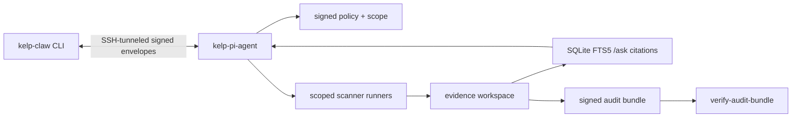

# KelpClaw

KelpClaw is a reproducible AppSec agent harness. It wraps AI-assisted security triage with scoped execution, policy gates, passive scanner evidence, SARIF output, replayable logs, and signed audit bundles.

The goal is not to be an autonomous exploit bot. KelpClaw is built for source and container owners who want AI-assisted vulnerability triage that can be reviewed, reproduced, and handed to security teams without trusting an opaque chat transcript.

## What It Does

- Builds a declared Dockerfile target and records build metadata.
- Imports scanner outputs from SARIF, Nuclei, ZAP, Nmap, Burp, and Nessus.
- Runs a scoped AppSec triage assistant through `--agent-command`.
- Forbids exploit execution by default under `appsec-agent-baseline`.
- Emits normalized findings, SARIF, logs, policy decisions, and signed evidence.
- Produces a static audit bundle that can be opened without running KelpClaw.

## Quickstart

```console
$ corepack enable
$ pnpm install --frozen-lockfile
$ pnpm --filter @kelpclaw/cli build
$ pnpm --filter @kelpclaw/cli exec kelp-claw doctor
```

Create an agent command that reads `KELPCLAW_APPSEC_INPUT` and writes JSON to `KELPCLAW_APPSEC_OUTPUT`, then run:

```console
$ kelp-claw appsec audit \
  --context . \
  --dockerfile Dockerfile \
  --agent-command ./appsec-agent.sh \
  --sarif findings.sarif \
  --out .kelpclaw/appsec/local
```

Verify the signed bundle:

```console
$ kelp-claw verify-audit-bundle .kelpclaw/appsec/local/audit-bundle
```

See [`docs/appsec-harness.md`](docs/appsec-harness.md) for the agent I/O contract and evidence layout.

## Kelp Pi

Kelp Pi extends KelpClaw onto a battery-powered Raspberry Pi 5 as a hardened, reproducible AppSec field drop-box: policy-gated scanning under operator-declared scope, signed audit bundles compatible with `kelp-claw verify-audit-bundle`, offline cited retrieval via `/ask`, no cloud dependency, and no exploit execution by default. Minimum hardware is Raspberry Pi 5 with 8GB RAM; 4GB boards are excluded because scanner state, SQLite FTS5 retrieval, audit signing, and bundle staging must run without swap-heavy thrash. Control plane stays in this TS monorepo; the Rust agent lives in `packages/pi-agent`. See [`docs/pi.md`](docs/pi.md), [`docs/pi-todo.md`](docs/pi-todo.md), and the full architecture diagram in [`docs/architecture.mmd`](docs/architecture.mmd).

Kelp Pi non-goals: operator anonymity, covert use, evasion, cellular or phone replacement features, always-listening voice, internet-scale scanning, scanning outside declared scope, target persistence, lateral movement, credential exfiltration, general self-hosting, and uncited generated answers.


```mermaid
flowchart LR
  cli["kelp-claw CLI"] <-->|"SSH-tunneled signed envelopes"| agent["kelp-pi-agent"]
  agent --> policy["signed policy + scope"]
  agent --> scan["scoped scanner runners"]
  scan --> evidence["evidence workspace"]
  evidence --> index["SQLite FTS5 /ask citations"]
  evidence --> bundle["signed audit bundle"]
  index --> agent
  bundle --> verify["verify-audit-bundle"]
```

## Existing Primitives

- `packages/evidence`: evidence workspaces, passive scanner imports, QA, signing, and verification.
- `packages/policy`: policy evaluator and built-in policy packs including `appsec-agent-baseline`.
- `packages/agent-hooks`: agent tool-event normalization.
- `packages/nanoclaw`: deterministic execution, Docker runner, replay data, hashes, and policy decisions.
- `packages/codegen`: artifact store and replay helpers.
- `packages/cli`: AppSec audit, skill audit, evidence, policy, inventory, SARIF, and audit bundle commands.
- `packages/workflow-spec`: shared workflow IR types, schemas, fixtures, and validators.
- `packages/testing`: deterministic harnesses and regression fixtures.

## CLI Surface

```console
$ kelp-claw help
$ kelp-claw appsec audit --context . --dockerfile Dockerfile --agent-command ./appsec-agent.sh
$ kelp-claw evidence import-sarif findings.sarif --workspace .kelpclaw/evidence
$ kelp-claw inventory scan --root . --policy appsec-agent-baseline
$ kelp-claw export-audit-bundle <runId> --include-sarif
```

## Safety Boundary

KelpClaw v1 does not execute exploits. Scanner execution can be done outside KelpClaw and imported as evidence. The AppSec assistant can correlate evidence and recommend validation, but active exploit validation is intentionally outside the default harness.

## Developer Setup

```console
$ pnpm -r build
$ pnpm -r test
```

## License

MIT. See [`LICENSE`](LICENSE).
