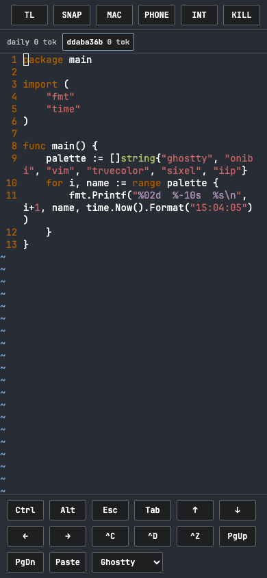
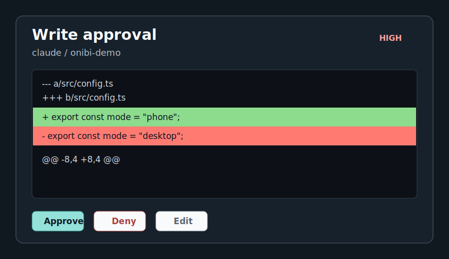

# Onibi Showcase

Short, sanitized asciinema demos for launch review. These casts are scripted local demos; they do not contain real tokens, hostnames, or user files.

| Demo | Cast | What it shows |
| --- | --- | --- |
| Pair and run | [`docs/casts/pair-and-run.cast`](docs/casts/pair-and-run.cast) | install, first-run hooks, LAN pair URL, paired phone, first terminal command |
| Approve and deny | [`docs/casts/approve-and-deny.cast`](docs/casts/approve-and-deny.cast) | approval card, approve path, deny path, audit rows |
| Handover | [`docs/casts/handover.cast`](docs/casts/handover.cast) | same tmux session moving phone -> Mac -> phone |
| Cloudflare Quick E2E | [`docs/casts/e2e-cloudflare.cast`](docs/casts/e2e-cloudflare.cast) | quick tunnel pair URL and app-layer E2E framing |

Playable embeds live on the docs landing page: [`docs/index.html#demo`](docs/index.html#demo).

## Cockpit Visuals

Verification status:

- [x] Casts are under 3 minutes.
- [x] Cast text is scrubbed for secrets and real hostnames.
- [x] Browser playback checked in Chrome, Firefox, and WebKit.
- [x] Native Safari app playback checked from `file://` with inline Data URL casts.
- [ ] Replacement with real launch recordings, if desired.
