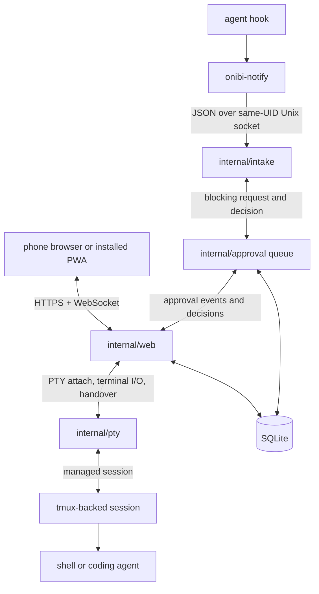

# Architecture

Onibi is a local coding-agent host with a phone web cockpit. It hosts shells and agents under PTYs, serves a local HTTPS/WebSocket UI, accepts hook events on a same-UID Unix socket, and stores durable state in SQLite.

## Component Map



## Invariants

- Pair tokens are single-use and short-lived.
- The owner browser gets an HttpOnly Secure cookie after pairing.
- WebSocket upgrades require the owner cookie plus the current session token.
- Hook socket peers must have the same OS UID as the daemon.
- Approval requests block at the tool boundary until a decision, timeout, or provider-specific hook failure.
- Same-user local compromise is out of scope.

## Pairing And Web

`onibi up` starts the local web server, mints a pair token, prints the pair URL, and renders a QR code.

The pair route sets the owner cookie and redirects to `/`. The frontend then opens:

- `/ws/pty` for terminal bytes.
- `/ws/events` for approval cards and event notifications.

iOS requires the printed Onibi local CA profile to be installed and fully trusted before Safari accepts the local HTTPS certificate.

## Session, PTY, And Handover

`onibi up` creates one managed tmux-backed session. The spawned shell receives:

```bash
ONIBI_SOCK=/path/to/onibi.sock
ONIBI_SESSION_ID=<managed-session-id>
```

The phone view is a web PTY attach client for that tmux session. `MAC` closes the web attach client and opens the same tmux session in Ghostty on macOS. `PHONE` detaches visible tmux clients and creates a fresh web attach client for Safari.

Soft keys send normal terminal escape sequences or control actions:

| control | behavior |
|---|---|
| `MAC` | opens the current managed tmux session in Ghostty on macOS |
| `PHONE` | returns the current managed tmux session to the phone web PTY |
| `ESC` | writes byte `0x1b` |
| `UP` | writes `\x1b[A` |
| `DN` | writes `\x1b[B` |
| `INT` | writes Ctrl-C (`0x03`) to the session, letting the TTY interrupt the foreground job |
| `KILL` | terminates the hosted process |

## Approval Flow

1. A provider hook calls `onibi-notify` with an approval request.
2. `onibi-notify` sends JSON to the intake socket.
3. The approval queue stores a pending request and wakes `/ws/events`.
4. The phone renders `Approve`, `Deny`, and `Edit`.
5. The phone posts the decision to `/approval/<id>`.
6. The queue unblocks the waiting hook.
7. The provider receives approved, denied, or edited tool input.

Approval event subscribers are capped by `daemon.max_subscribers` (default `32`); slow subscribers still drop their oldest queued events instead of backpressuring decisions.

Approval states:

```text
pending -> approved
pending -> denied
pending -> edited
pending -> expired
pending -> cancelled
```

## Storage

SQLite path:

```text
<state-dir>/onibi.sqlite
```

The DB uses WAL, foreign keys, and one open connection. File permissions are forced to `0600`.

Main durable state:

| data | purpose |
|---|---|
| pairing tokens | one-time web pairing |
| approvals | tool decision state |
| audit | decisions, prompts, sessions, risk events |
| hooks | installed hook path, hash, version |
| sessions | active and ended PTY/tmux sessions |
| kv | config and transient values |

## Legacy Code

No v2 Telegram MiniApp/webapp transport code remains. Current user flows use the LAN web cockpit described here; generated frontend bundles may still contain unrelated third-party syntax aliases.
