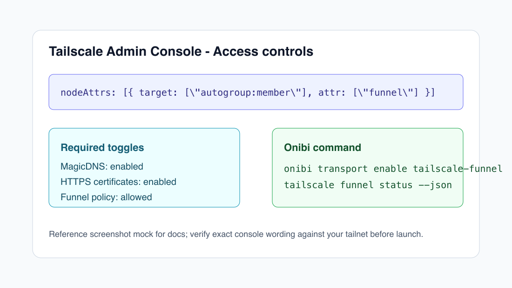
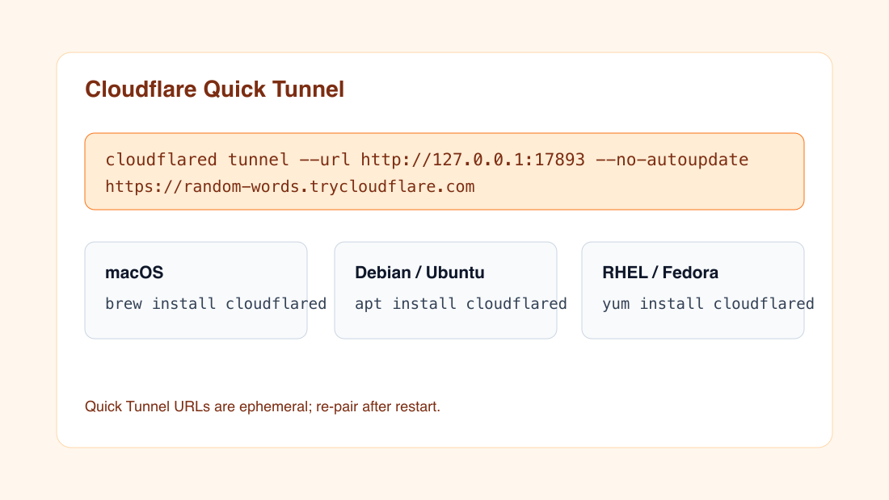
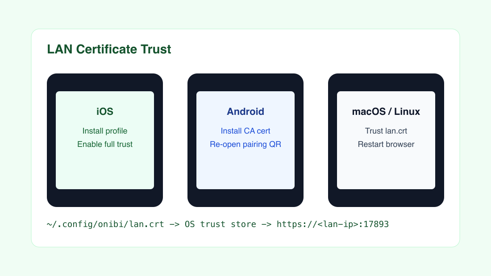

# Transports

Onibi starts the approval server on `127.0.0.1:17893`. Transports publish that same protocol to the phone without requiring inbound firewall rules.

Use all three during development; recommend one during onboarding:

| Transport | Best for | Account | Phone on LTE | URL lifetime | Notes |
| --- | --- | --- | ---: | --- | --- |
| Tailscale Funnel | Daily personal use | Tailscale | Yes | Stable tailnet DNS | Best persistent option if you already use Tailscale. |
| Cloudflare Quick Tunnel | Demos and first-time trials | No | Yes | Ephemeral | Random `trycloudflare.com` URL changes when restarted. |
| LAN HTTPS | Same Wi-Fi fallback | No | No | Stable while IP stays stable | Requires trusting Onibi's self-signed cert on the phone. |

The pairing QR includes every enabled transport:

```json
{
  "machine_id": "01J...",
  "token": "<bearer token>",
  "vapid_public_key": "<public key>",
  "transports": [
    { "name": "tailscale-funnel", "url": "https://host.tailnet.ts.net/" },
    { "name": "cloudflared", "url": "https://random.trycloudflare.com/" },
    {
      "name": "lan",
      "url": "https://192.168.1.42:17893/",
      "fingerprint": "sha256:..."
    }
  ]
}
```

The PWA tries transports in order and reconnects through the next working URL if one fails.

## CLI

```sh
onibi --headless
onibi transport list
onibi transport status
onibi transport enable tailscale-funnel
onibi transport enable cloudflared
onibi transport enable lan
onibi transport disable cloudflared
```

`enable` and `disable` talk to the running daemon so child processes and tunnel handles stay alive.

## Tailscale Funnel

Reference: <https://tailscale.com/docs/features/tailscale-funnel>

Tailscale Funnel exposes one local service through a public HTTPS URL under your tailnet DNS name. Tailscale documents these launch requirements: Tailscale v1.38.3 or later, MagicDNS enabled, HTTPS certificates enabled, and a tailnet policy that allows the `funnel` node attribute.



Setup:

```sh
tailscale version
tailscale up
tailscale status --json
onibi transport enable tailscale-funnel
onibi transport status
```

What Onibi runs:

```sh
tailscale funnel --bg 17893
tailscale funnel status --json
```

Troubleshooting:

| Symptom | Fix |
| --- | --- |
| `tailscale CLI not found` | Install Tailscale and ensure `tailscale version` works in the same shell that launches Onibi. |
| Not logged in | Run `tailscale up`. |
| Funnel policy denied | In the Tailscale admin console, enable Funnel for your tailnet policy. |
| DNS URL does not resolve yet | Wait for DNS propagation; Tailscale notes this can take several minutes. |
| Certificate or quota errors | Stop repeated enable/disable loops; use Cloudflare or LAN while the limit clears. |

## Cloudflare Quick Tunnel

References:

- <https://developers.cloudflare.com/cloudflare-one/connections/connect-networks/do-more-with-tunnels/trycloudflare/>
- <https://developers.cloudflare.com/cloudflare-one/connections/connect-networks/downloads/>

Cloudflare Quick Tunnels generate a random `trycloudflare.com` URL and proxy it to localhost. Cloudflare positions Quick Tunnels as testing/development infrastructure; use named tunnels for production.



macOS:

```sh
brew install cloudflared
cloudflared --version
onibi transport enable cloudflared
```

Debian / Ubuntu:

```sh
sudo mkdir -p --mode=0755 /usr/share/keyrings
curl -fsSL https://pkg.cloudflare.com/cloudflare-main.gpg \
  | sudo tee /usr/share/keyrings/cloudflare-main.gpg >/dev/null
echo "deb [signed-by=/usr/share/keyrings/cloudflare-main.gpg] https://pkg.cloudflare.com/cloudflared any main" \
  | sudo tee /etc/apt/sources.list.d/cloudflared.list
sudo apt-get update
sudo apt-get install cloudflared
cloudflared --version
onibi transport enable cloudflared
```

RHEL / Fedora:

```sh
curl -fsSL https://pkg.cloudflare.com/cloudflared.repo \
  | sudo tee /etc/yum.repos.d/cloudflared.repo
sudo yum update
sudo yum install cloudflared
cloudflared --version
onibi transport enable cloudflared
```

What Onibi runs:

```sh
cloudflared tunnel --url http://127.0.0.1:17893 --no-autoupdate
```

Troubleshooting:

| Symptom | Fix |
| --- | --- |
| `cloudflared not found` | Install via Homebrew or the Cloudflare package repository. |
| Quick Tunnel refuses to start | Move conflicting `~/.cloudflared/config.yaml` aside for the demo. |
| URL changed | Re-open the pairing QR; Quick Tunnel URLs are ephemeral. |
| Corporate firewall blocks tunnel | Allow outbound Cloudflare Tunnel traffic or use Tailscale/LAN. |

## LAN HTTPS

LAN mode is the no-account path for same-Wi-Fi use. Onibi creates:

```text
~/.config/onibi/lan.crt
~/.config/onibi/lan.key
```

The certificate includes `localhost`, `127.0.0.1`, and discovered LAN IPv4 addresses as SANs. The daemon starts a TLS listener on the selected LAN IP and proxies traffic to the loopback server. It also advertises `_onibi._tcp.local.` with mDNS.



Enable:

```sh
onibi transport enable lan
onibi transport status
```

Verify from another machine on the same Wi-Fi:

```sh
curl -k https://<lan-ip>:17893/healthz
```

### iOS / iPadOS Certificate Install

1. Export or AirDrop `~/.config/onibi/lan.crt` to the device, or scan the LAN certificate QR in Onibi.
2. Open the downloaded profile.
3. Go to Settings > General > VPN & Device Management and install the profile.
4. Go to Settings > General > About > Certificate Trust Settings.
5. Enable full trust for the Onibi certificate.
6. Re-open the pairing QR and choose the LAN URL.

### Android Certificate Install

1. Copy `~/.config/onibi/lan.crt` to the device.
2. Open Settings > Security > Encryption & credentials.
3. Choose Install a certificate > CA certificate.
4. Select the Onibi certificate and confirm.
5. Re-open the pairing QR and choose the LAN URL.

Browser behavior differs by Android version. Chrome may still restrict user-installed CA roots for some app contexts; use Tailscale or Cloudflare if LAN trust becomes noisy.

### macOS Certificate Install

1. Open Keychain Access.
2. Drag `~/.config/onibi/lan.crt` into the System or login keychain.
3. Open the certificate, expand Trust, and set "When using this certificate" to "Always Trust".
4. Restart the browser before testing.

### Linux Certificate Install

Debian / Ubuntu:

```sh
sudo cp ~/.config/onibi/lan.crt /usr/local/share/ca-certificates/onibi.crt
sudo update-ca-certificates
```

Fedora:

```sh
sudo cp ~/.config/onibi/lan.crt /etc/pki/ca-trust/source/anchors/onibi.crt
sudo update-ca-trust
```

## Security Notes

- The bearer token is mandatory on every API and WebSocket route.
- HSTS is sent for tunnel-bound HTTPS responses, not LAN self-signed responses.
- LAN certificate trust is an OS-level step; browser JavaScript cannot pin a self-signed cert before TLS succeeds.
- Rotate the token after demos with `onibi token rotate`.

## Support

Run:

```sh
onibi doctor
```

Paste the output into the issue. It reports token storage, DB writability, port availability, and adapter binary detection.
