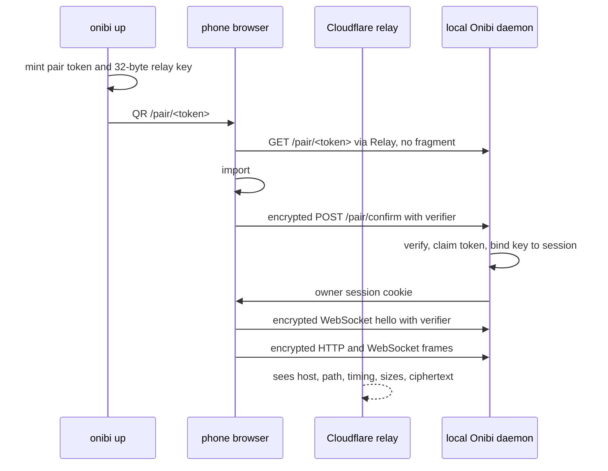

# How Onibi's E2E Frame Protocol Works

Onibi's Cloudflare Quick transport has a hard constraint: the relay is useful for
reachability, but it is not trusted with terminal bytes. The phone may be on LTE,
the laptop may be behind a NAT, and Cloudflare may terminate TLS for the public
`trycloudflare.com` hostname. Even in that mode, the relay should only move
ciphertext. It should not see PTY output, typed input, approval payloads, control
requests, or approval decisions.

That is what the Onibi E2E relay protocol is for. It is not a replacement for
TLS and it is not a general messaging protocol. It is an app-layer frame format
that sits inside Onibi's HTTP and WebSocket traffic when a third-party relay is
selected. The reference version is `onibi.e2e.v1`, implemented in Go under
`internal/envelope/relay.go` and in the browser under `frontend/src/e2e.ts`.

The core shape is simple:



## Fragment-Keyed Bootstrap

The QR URL looks like this:

```text
https://<id>.trycloudflare.com/pair/<pair-token>#k=<base64url-key>
```

`<pair-token>` is routing and pairing state. `<base64url-key>` is 32 random
bytes, encoded without padding. The important boundary is the `#`. URI fragments
are processed client-side and are not sent in the HTTP request to the server, as
MDN's URI fragment reference documents.[^mdn-fragment] Onibi uses that property
to put the bootstrap key where JavaScript can read it but the relay and the Go
handler do not receive it in the URL, headers, request body, or normal server
logs.

The browser imports the raw key into Web Crypto as an HKDF input and immediately
removes the fragment with `history.replaceState`. That does not make the phone
memory secret from the phone. It only avoids leaving the key visible in the
location bar and avoids accidental reuse of a live URL with `#k=...`
still attached.

The public session identifier reaches the relay while the browser-side fragment
carries the material the relay must not receive. Onibi binds that split to one
owner session and its approval model.

## Key Schedule

Onibi uses HKDF-SHA256 for key separation. HKDF is specified by RFC 5869 as an
extract-and-expand KDF built from HMAC.[^rfc5869] The initial input keying
material is `K_pair`, the 32-byte value from `#k=`.

After pairing succeeds, the daemon creates an owner web session. Both sides
derive a session base key:

```text
K_session = HKDF-SHA256(
  IKM  = K_pair,
  salt = session_id,
  info = "onibi-e2e-v1",
  L    = 32
)
```

Each HTTP request or WebSocket connection then gets a 16-byte random
`stream_id`. For each `(stream_id, channel, direction)` tuple, Onibi derives an
AES-256-GCM key:

```text
K_stream = HKDF-SHA256(
  IKM  = K_session,
  salt = stream_id,
  info = "onibi-e2e-stream-v1:" || channel || ":" || dir,
  L    = 32
)
```

The nonce is also derived, but only as a prefix:

```text
nonce_prefix = HKDF-SHA256(
  IKM  = K_session,
  salt = stream_id,
  info = "onibi-e2e-nonce-v1:" || channel || ":" || dir,
  L    = 4
)

iv = nonce_prefix || uint64_be(seq)
```

That gives a 96-bit AES-GCM IV: 32 bits from HKDF plus a 64-bit sequence number.
NIST SP 800-38D specifies Galois/Counter Mode and describes its 96-bit IV shape
as the recommended default for efficiency and interoperability.[^nist-gcm] Onibi
does not use random IVs for frames. It uses deterministic IVs from a stream-local
counter so both sides can reject gaps, repeats, and forged IV values before any
plaintext is released.

## Frame Format

HTTP request and response bodies use `Content-Type:
application/onibi-e2e+json`. WebSocket encrypted traffic is carried as text
frames containing the same JSON object:

```text
+---------------------------------------------------------------+
| v | sid | st | ch | dir | seq | iv | t | ct                   |
+---------------------------------------------------------------+
| protocol/version and authenticated routing metadata | payload |
+---------------------------------------------------------------+
```

Concrete fields:

```json
{
  "v": "onibi.e2e.v1",
  "sid": "<session_id>",
  "st": "<stream_id>",
  "ch": "ws:pty",
  "dir": "c2s",
  "seq": 0,
  "iv": "<base64url 12-byte IV>",
  "t": "binary",
  "ct": "<base64url ciphertext-and-tag>"
}
```

The cipher is AES-256-GCM. RFC 5116 defines the AEAD interface: plaintext is
encrypted, associated data is authenticated, and the receiver either gets the
plaintext or an authentication failure.[^rfc5116] In Onibi, `ct` is the AES-GCM
ciphertext followed by the 16-byte tag.

The associated data is not another field inside the frame. Receivers reconstruct
it from the metadata they are about to enforce:

```text
v || "\n" ||
sid || "\n" ||
st || "\n" ||
ch || "\n" ||
dir || "\n" ||
decimal(seq) || "\n" ||
iv || "\n" ||
t
```

That design matters. The relay can edit JSON fields, reorder frames, or replay
old bytes. It cannot produce a valid AES-GCM tag for edited metadata unless it
has the derived stream key. The receiver also checks that the decoded `iv` is
exactly 12 bytes and exactly equals `nonce_prefix || uint64_be(seq)`. A frame
with a valid-looking `seq` but a mismatched IV is rejected.

## Replay And Ordering

WebSockets are stateful. Each side tracks the next expected sequence number for
the tuple `(session_id, stream_id, channel, direction)`. `seq` starts at zero.
The receiver accepts only the exact expected value, then increments. A duplicate,
skip, lower value, nonnumeric value, or stream switch is a protocol error and
closes the socket.

HTTP is different because every request is independent. The browser creates a
fresh `stream_id` and sends `seq = 0`. The server stores accepted
`(session_id, stream_id, channel, direction, seq)` tuples in a bounded replay
cache for at least ten minutes. A duplicate encrypted request returns HTTP 409.
The response reuses the request stream id with `dir = s2c` and `seq = 0`.

This does not stop the relay from dropping or delaying traffic. It does stop a
previously accepted encrypted approval decision or control request from being
accepted twice inside the replay window.

## Pair And Session Verification

The raw relay key is volatile. During pairing, the daemon stores a commitment
for the pair token, not the raw key in SQLite. `/pair/<token>` serves a pairing
page that reads the fragment key, removes the fragment, derives a pair verifier,
and sends it inside encrypted `POST /pair/confirm`. Only after that verifier
matches does the daemon claim the single-use token and bind `K_pair` to the new
owner session. It also stores a verifier derived as HKDF-SHA256 over `K_pair`
with `salt = session_id` and `info = "onibi-e2e-session-verifier-v1"`.

The first encrypted WebSocket hello includes that session verifier. The server
checks it in constant time before accepting PTY or events traffic. With relay E2E
required, a copied cookie is not enough to attach to those WebSockets. The
browser must also know the fragment key from the QR so it can derive the
session key, seal the first frame, and send the matching verifier.

## Failure Behavior

Onibi fails closed for the relay path. A browser without `#k=` cannot derive the
session key, so encrypted HTTP and WebSocket attach traffic cannot complete.
A bad key length fails before network use. A bad verifier returns unauthorized.
A bad AES-GCM tag, bad AAD binding, bad IV, or replayed sequence is rejected
without exposing partial decrypted data. If the daemon restarts and loses
volatile relay keys, the user must run a fresh pair.

Release builds must not silently downgrade Cloudflare Quick traffic to plaintext.
Cloudflare relay transport now requires app-layer E2E, and no plaintext bypass
is shipped.

## What We Do Not Protect Against

This protocol does not make a compromised laptop safe. Same-user malware, a
debugger attached to Onibi, or a process reading browser memory can still see
plaintext at the endpoint.

It does not protect against a malicious browser extension after pairing. The
extension runs where the decrypted UI data exists.

It does not protect against a stolen unlocked phone with an active paired
session. The active browser has the session and derived keys.

It does not hide metadata from the relay. Cloudflare can still see the hostname,
paths, timing, byte lengths, connection count, and whether traffic is active.

It does not provide availability. The relay can drop, delay, reorder, or deny
traffic. Onibi detects some tampering as authentication or sequence failures,
but it cannot force the relay to deliver packets.

It also relies on the browser Web Crypto implementation and Go's crypto
implementation behaving correctly. The protocol narrows what Onibi asks those
libraries to do; it does not audit them.

## Why This Shape

The protocol is intentionally small. HKDF separates keys by session, stream,
channel, and direction. AES-GCM gives one primitive for confidentiality and
metadata authentication. Sequence numbers make WebSocket ordering explicit and
give HTTP requests a replay key. Fragments keep the initial key out of the relay
request path.

The result is not "Cloudflare cannot learn anything." It is narrower and more
testable: when Cloudflare Quick is the relay, Onibi's terminal bytes, approval
payloads, typed input, and control bodies cross that relay as authenticated
ciphertext, while the documented metadata remains visible.

[^mdn-fragment]: MDN Web Docs, "URI fragment", <https://developer.mozilla.org/en-US/docs/Web/URI/Reference/Fragment>.
[^rfc5869]: RFC 5869, "HMAC-based Extract-and-Expand Key Derivation Function (HKDF)", <https://www.rfc-editor.org/info/rfc5869/>.
[^rfc5116]: RFC 5116, "An Interface and Algorithms for Authenticated Encryption", <https://www.rfc-editor.org/info/rfc5116/>.
[^nist-gcm]: NIST SP 800-38D, "Recommendation for Block Cipher Modes of Operation: Galois/Counter Mode (GCM) and GMAC", <https://csrc.nist.gov/pubs/sp/800/38/d/final>.
