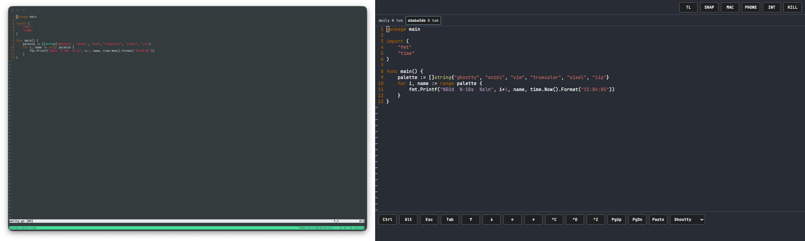
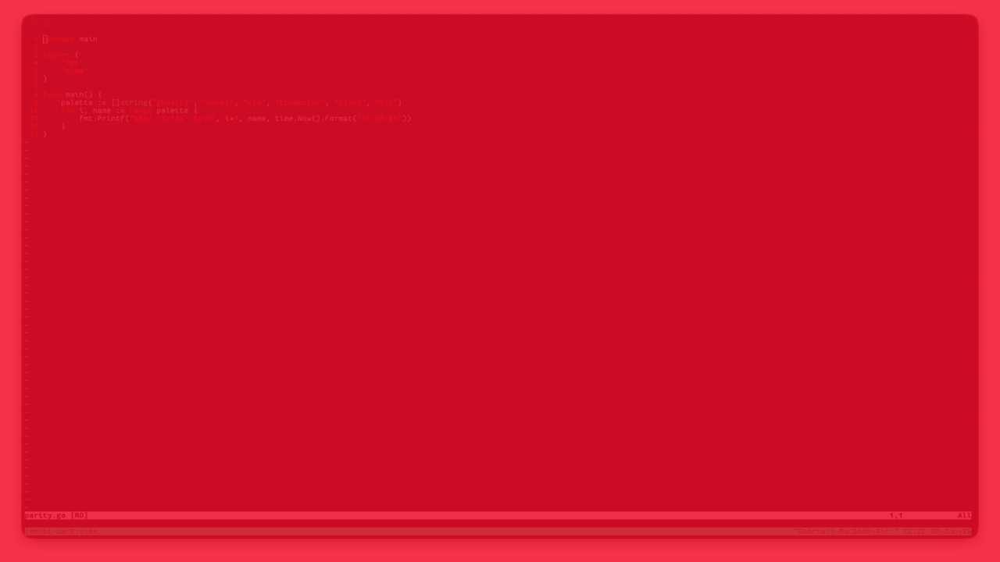
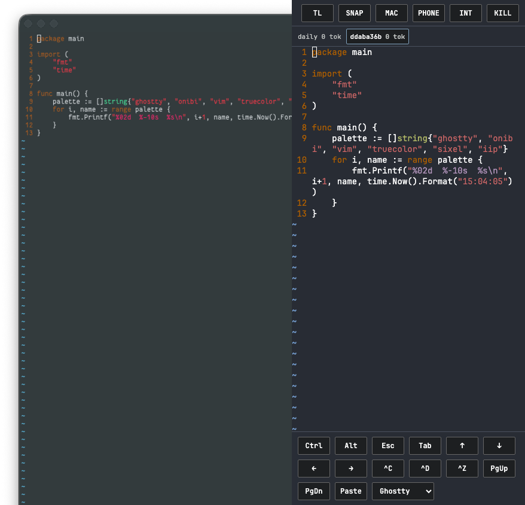
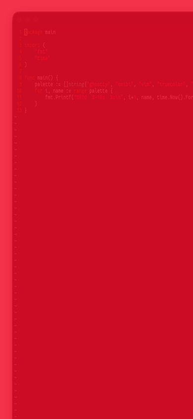

# Ghostty Parity Smoke

Disclaimer: Onibi is not affiliated with the [Ghostty](https://ghostty.org) terminal emulator project. Onibi uses `xterm-ghostty` terminfo and a Ghostty-inspired color theme; see [Branding](branding.md).

Date: 2026-06-30

Fixture: the same `vim -Nu NONE -n -R` session on `/tmp/onibi-t2309.kRs641/parity.go`, served from tmux target `onibi-parity-t2309`.

## Landscape

Left: native Ghostty. Right: Onibi browser cockpit.

Pixel diff: RMSE `7943.87` (`0.121216` normalized) after resizing both captures to `1280x720`.

## Portrait

Left: native Ghostty crop. Right: Onibi browser cockpit at `390x844`.

Pixel diff: RMSE `7688.01` (`0.117311` normalized) after resizing both captures to `390x844`.

## Notes

- Vim content, syntax colors, line numbers, cursor position, and tmux state are visible in both renderers.
- Browser capture includes cockpit controls and soft keys; native capture includes Ghostty chrome and tmux status, so this is a visual parity smoke, not a pixel-perfect terminal-cell diff.
- Portrait browser wrapping differs from the native crop because the cockpit viewport is narrower and includes persistent controls.
