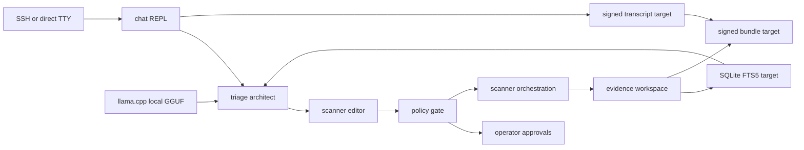

# Kelp Pi Design

## Status

This is the active design for the local-only Kelp Pi pivot. The target product surface is a single Zig binary named `kelp-pi` running on Raspberry Pi 5. Legacy TypeScript and Rust code remains as reference material until parity.

Verified during this patch:

- Official Zig download/news pages list Zig 0.16.0 as the latest stable release dated 2026-04-14.
- Local dev toolchain is Zig 0.15.2; `zig build` and `zig build test` pass with it.
- Hugging Face repo `bartowski/Qwen_Qwen3-0.6B-GGUF` exposes Qwen3 0.6B GGUF quantizations compatible with `llama.cpp`.

Sources checked: <https://ziglang.org/download/>, <https://ziglang.org/news/0.16.0-released/>, and <https://huggingface.co/bartowski/Qwen_Qwen3-0.6B-GGUF>.

Unverified until Pi hardware run:

- Raspberry Pi 5 memory headroom.
- Native `llama.cpp` load and prompt smoke with `-Dllama=true`.
- Scanner sandboxing through systemd/nftables.
- Bundle signature validation on a clean host.

## Product Contract

One sentence: fully local AppSec triage chat for Raspberry Pi 5: no API keys, no cloud provider, no egress requirement, no rate limits, signed reproducible evidence.

Operator concern to preserve verbatim: user-cited examples `Fable` and `GPT-5.6` as examples of progressively guardrailed cloud-hosted agents. This repo does not verify those examples.

Primary persona: red-teamer or security researcher on an authorized, airgapped or egress-restricted engagement.

Non-goals: exploit bot, covert implant, target persistence, lateral movement, credential theft, internet-scale scanning, phone replacement, anonymous operation, and uncited generated answers.

## Runtime Architecture



There is no runtime control plane. A laptop may be used to flash the OS or copy release assets, but the engagement flow runs on the Pi.

## Data Layout

```text
/var/lib/kelp-pi/
  approvals/
  audit/
  bundles/
  evidence/
  index/
  keys/
  models/
  scope/
  sessions/
```

Key custody target: the Pi generates and stores the signing key locally. Exporting the private key is out of scope. Current Zig scaffold writes an Ed25519 key JSON but does not yet harden file mode or support passphrase encryption.

## Zig Surface

Current source:

- `build.zig`
- `app/main.zig`
- `policies/appsec-agent-baseline.toml`
- `models/manifest.toml`

Current commands:

```console
$ kelp-pi version
$ kelp-pi doctor
$ kelp-pi keygen
$ kelp-pi policy check --tool Bash --command 'nuclei -u http://target'
$ kelp-pi scope set --host http://fixture.local --until 2026-12-31T00:00:00Z
$ kelp-pi approval-request --scope-id default --command 'nuclei http://fixture.local'
$ kelp-pi approve <token>
$ kelp-pi scan nuclei --target http://fixture.local --approval-token <token> --dry-run
$ kelp-pi index ingest --input findings.json --path evidence/findings.json
$ kelp-pi ask default
$ kelp-pi model warm --id qwen3-0.6b-q4_k_m
$ kelp-pi bundle assemble --run-id local --workspace . --output audit-bundle
$ kelp-pi verify-bundle audit-bundle
$ kelp-pi chat
```

## Model Runtime

Primary model target: Qwen3 0.6B Q4_K_M GGUF through direct `llama.cpp` linkage.

Reasoning:

- 0.6B-class model is small enough to test on the 4GB Pi floor. [Inference]
- Q4_K_M is the desired size/quality tradeoff for first hardware validation. [Inference]
- Direct `llama.cpp` keeps the runtime single-binary-oriented and avoids an Ollama daemon.
- Host smoke path: `pnpm llama:smoke` builds `libllama`, links `kelp-pi`, loads the pinned GGUF, and decodes greedy tokens.

The primary GGUF SHA-256 is pinned in `models/manifest.toml`. Release packaging should fail if any primary model SHA is blank or mismatched.

## Policy

Policy source is `policies/appsec-agent-baseline.toml`, ported from `packages/policy/src/packs.ts`.

Precedence: `deny` outranks `require-approval`, which outranks `log-only`, which outranks `allow`.

Required default behavior:

- Deny destructive shell.
- Deny secret exfiltration.
- Deny exploit execution.
- Deny persistence and lateral movement.
- Require approval for active scanners.
- Require approval for container runtime actions beyond build.
- Log Docker build metadata.

There is no YOLO or auto-approve-all mode. AppSec output needs per-action accountability; mass approval breaks the audit story.

## Chat Loop

Target loop:

```text
read context -> propose action -> evaluate policy -> request approval if needed -> execute/import -> cite evidence -> repeat
```

Action tags map to fixed policy classes:

- `read`: local evidence reads.
- `evidence-import`: passive scanner/result import.
- `retrieval-query`: index search.
- `scanner-active`: Nuclei/Nmap/ZAP invocation.
- `policy-mutation`: policy or scope changes.
- `bundle-sign`: final evidence signing.

Only `read`, `evidence-import`, and `retrieval-query` may become granular auto-allow candidates. `scanner-active`, `policy-mutation`, and `bundle-sign` require explicit operator accountability.

## Scanner Aarch64 Strategy

Sources checked 2026-07-02: ProjectDiscovery `nuclei` GitHub release `v3.10.0` (<https://github.com/projectdiscovery/nuclei/releases/tag/v3.10.0>), Debian/Raspberry Pi OS Bookworm `nmap` (<https://packages.debian.org/bookworm/nmap>), and ZAP official Docker/download docs (<https://www.zaproxy.org/docs/docker/about/>, <https://www.zaproxy.org/download/>).

- Nuclei: bundled from `projectdiscovery/nuclei` release asset `nuclei_3.10.0_linux_arm64.zip`; archive SHA-256 `b0ddb1f0cc894b7fa79e45043d00a5ffd2cc9fc15e169bf567d1a384eae51427`; installed binary SHA-256 `579859c6192abd8204ec22ab88e39de8f138d955c283ed99a59fdb3cea451803`; templates remain pinned by revision.
- Nmap: installed from the signed Raspberry Pi OS/Debian apt repository as package `nmap`; readiness records `nmap --version` because package hashes are owned by apt repository metadata.
- ZAP: not installed by default on the 4GB Pi profile; only enable through an operator-supplied container image digest (`KELP_PI_ZAP_IMAGE_DIGEST`) so field runs never use a mutable tag as evidence.

The installer and image staging write `/etc/kelp-pi/scanners.json`. `kelp-pi-validate-node` fails if the scanner strategy is absent, if Nuclei hashes drift, if Nmap is unavailable, or if ZAP is enabled without an immutable digest.

## Evidence And Bundles

Target outputs:

- Append-only session transcript.
- Normalized findings.
- Scanner stdout/stderr and raw imports.
- Policy decisions.
- Retrieval citations.
- Static `index.html`.
- Manifest, file hashes, Ed25519 signature, and public key.

Current Zig implementation signs `manifest.json` with the Pi Ed25519 key, verifies manifest file hashes/signature, and writes a hash-chained audit log with a head sidecar.

### Legacy Bundle Smoke Coverage

Keep `pnpm test:pi-bundle-smoke` in CI until Zig bundle generation can replace both legacy checks:

- Replay smoke: Pi-produced bundle fetch/import verifies on the laptop CLI with policy sync audit events present.
- Equivalence smoke: legacy TypeScript and Pi bundle contracts expose the same reviewer-required files, manifest/signature paths, run ID, status, compatibility, and policy pack fields.

Delete `scripts/pi-bundle-replay-smoke.mjs`, `scripts/pi-bundle-equivalence-smoke.mjs`, and their package scripts only after Zig `kelp-pi bundle assemble`, export/import, and host verification cover those same contracts without `packages/pi-agent` or `packages/cli`.

## Legacy Mapping

| Existing path                     | Target                                        |
| --------------------------------- | --------------------------------------------- |
| `packages/pi-agent/src/main.rs`   | `app/main.zig`                                |
| `packages/pi-agent/src/policy.rs` | `app/policy/*` target plus `policies/*.toml`  |
| `packages/pi-agent/src/ollama.rs` | delete; replace with `app/model/llamacpp.zig` |
| `packages/pi-agent/src/index.rs`  | `app/retrieval/*` with SQLite FTS5            |
| `packages/pi-agent/src/bundle.rs` | `app/bundle/*`                                |
| `packages/cli`                    | legacy laptop CLI until cutover               |
| `packages/web-intel`              | legacy; no live web in Pi runtime             |

## Acceptance

Release is blocked until this passes on a freshly flashed Raspberry Pi 5:

1. `kelp-pi doctor` passes.
2. Primary GGUF hash verifies.
3. `kelp-pi model warm --id qwen3-0.6b-q4_k_m` loads through `llama.cpp`.
4. Passive scanner fixture imports into the evidence workspace.
5. `kelp-pi ask` returns a cited answer from local index data.
6. Active scanner request requires approval before dry-run or execution.
7. Bundle generation signs transcript, evidence, policy decisions, and manifest.
8. `kelp-pi verify-bundle <bundle>` passes on a clean host.
