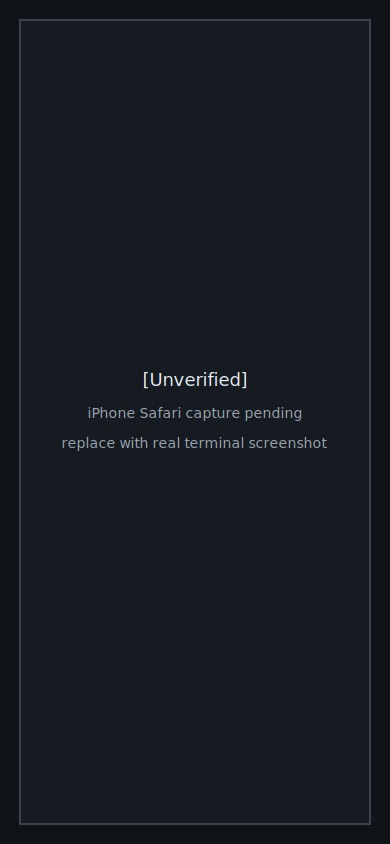

# Terminal Fidelity Smoke Matrix

Status: [Unverified] real iPhone Safari screenshots have not been captured in this repo state.

Test surface: iPhone Safari paired to `onibi up`, using the live web terminal cockpit over HTTPS/WebSocket.

Use `scripts/terminal-smoke.sh` from inside the paired phone terminal to cover host-side checks. The script verifies commands that can run without human keypresses and reports manual rows separately.

## Matrix

| App | Phone action | Auto coverage | Expected behavior | Screenshot |
| --- | --- | --- | --- | --- |
| `vim` | Open `vim`, edit text, use arrows, `Esc`, `:wq`. | `scripts/terminal-smoke.sh` runs Vim in ex mode and writes a fixture. | Full-screen editor input, status line, cursor, escape keys, and write/quit remain usable. |  |
| `nvim` | Open `nvim`, edit text, use arrows, `Esc`, `:wq`. | Script runs Neovim in ex mode when installed. | Same Vim behavior with Neovim rendering and input. |  |
| `emacs` | Open `emacs -nw`, move cursor, type, save, quit. | Script runs Emacs batch write when installed. | Control/meta input and full-screen redraw remain usable. |  |
| `tmux` | Create panes/windows, switch panes, detach/attach. | Script creates a detached tmux session and captures pane output. | Pane redraw, status bar, detach/attach, and Onibi handoff preserve the same session. |  |
| `less` | Page a long file, search text, quit. | Script opens a short fixture with `less -F -X` when installed. | Paging, search highlight, quit, and viewport resize remain usable. |  |
| `htop` | Open `htop`, scroll, sort, quit. | Script checks `htop --version` when installed. | Alternate-screen redraw, function keys, color, and quit remain usable. |  |
| `claude` / `codex` / `opencode` | Start an agent CLI, type prompt text, handle approval or interrupt. | Script checks installed agent CLIs only. | Agent TUI output, prompts, streaming text, interrupt, and approval handoff remain readable. |  |
| `ranger` / `fzf` / `gum` | Open selector/file UI, navigate, select, quit. | Script runs `fzf --filter` when installed and checks `ranger`/`gum` presence. | TUI selection, arrows, search/filter input, and quit remain usable. |  |

## Screenshot Capture

Save real phone captures under `docs/assets/terminal-fidelity/` and replace the placeholder image links above:

| App | Target artifact |
| --- | --- |
| `vim` | `docs/assets/terminal-fidelity/vim.png` |
| `nvim` | `docs/assets/terminal-fidelity/nvim.png` |
| `emacs` | `docs/assets/terminal-fidelity/emacs.png` |
| `tmux` | `docs/assets/terminal-fidelity/tmux.png` |
| `less` | `docs/assets/terminal-fidelity/less.png` |
| `htop` | `docs/assets/terminal-fidelity/htop.png` |
| `claude` / `codex` / `opencode` | `docs/assets/terminal-fidelity/agents.png` |
| `ranger` / `fzf` / `gum` | `docs/assets/terminal-fidelity/selectors.png` |

## Runbook

1. Start Onibi on the Mac: `onibi up --transport=lan`.
2. Pair from iPhone Safari and open the terminal cockpit.
3. Run `scripts/terminal-smoke.sh` from the phone terminal.
4. Run each manual phone action in the matrix.
5. Capture iPhone Safari screenshots and replace the placeholder embeds.
6. Keep issue verification open until the script output and real screenshots are attached.
